

# K 近邻 (KNN) 与基于实例的学习

## 1 背景与动机

传统机器学习模型多采用 **模型假设 + 参数估计** 的思路（如线性回归、MAP、ML、朴素贝叶斯等）。但有没有一种方法不依赖于模型假设？

人们通过记忆和类比来推理学习——"思考即回忆" (Thinking is reminding, making analogies)，所谓 **近朱者赤，近墨者黑** 。基于实例的学习正是这种思想的体现：

## 2 参数化与非参数化

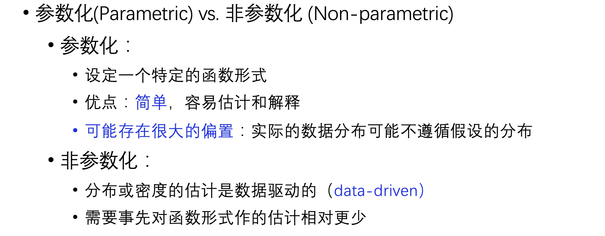

机器学习方法可以分为 **参数化** (Parametric) 和 **非参数化** (Non-parametric) 两种：

- **参数化** ：
    - 设定一个特定的函数形式。
    - 优点：简单，容易估计和解释。
    - 缺点：可能存在很大的 **偏置** (bias)——实际的数据分布可能不遵循假设的分布。
- **非参数化** ：
    - 分布或密度的估计是 **数据驱动** (data-driven) 的。
    - 需要事先对函数形式作的假设相对更少。

基于实例的学习（Instance-based Learning, IBL）是非参数化方法的典型代表，也称为基于记忆的学习 (Memory-Based Learning)、基于样例的学习 (Case-Based Learning)、基于相似度的学习 (Similarity-Based Learning)。

- 核心思想：通过比较未知数据和已知数据的 **相似度** (Similarity)，来将其归为已有的类别。
- 特点：
    - 无需构建模型，仅存储所有训练样例。
    - 直到有 **新样例** 需要分类，才开始进行处理（即 **延迟学习** ，Lazy Learning）。

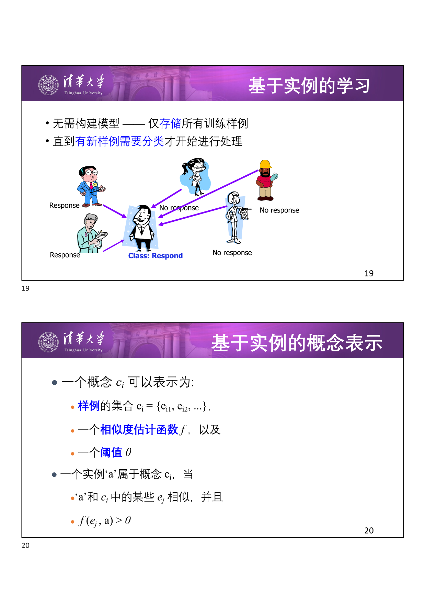

!!! abstract "定义 1（基于实例的概念表示）"

    一个概念 $c_i$ 可以表示为：

    - 样例的集合 $c_i = \{e_{i1}, e_{i2}, \dots\}$
    - 一个相似度估计函数 $f$
    - 一个阈值 $\theta$

    一个实例 $a$ 属于概念 $c_i$，当 $a$ 和 $c_i$ 中的某些 $e_j$ 相似，并且满足：

    $$
    f(e_j, a) > \theta
    $$

这里， **相似度的常用估计是距离** 。每个数据都有各种 **属性** ，表现为数值向量。通过比较不同数据的各个属性，可以计算它们之间的 **距离** 。

## 3 最近邻与 K 近邻 (KNN)

### 3.1 1-NN (最近邻)

**1-NN** (1 Nearest Neighbor) 即找到距离最近的一个点，将其 **标签** 作为预测值。

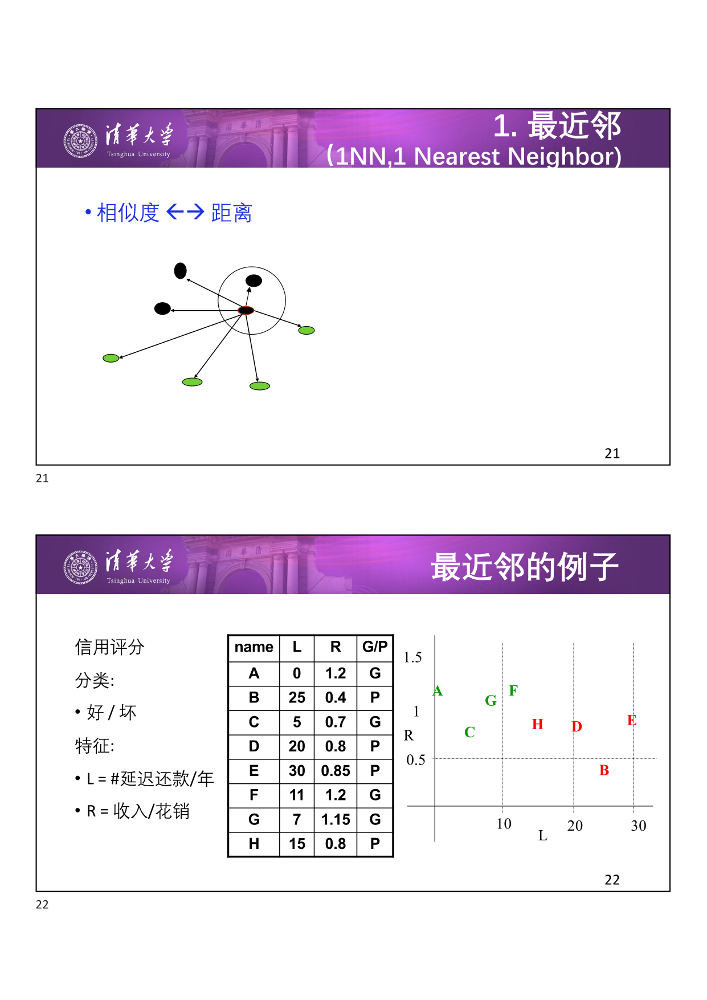

???+ example "例 1：信用评分 (1-NN)"

    给定以下训练数据（特征：$L$ = 延迟还款次数/年，$R$ = 收入/花销比；标签：G = 好，P = 坏），对新样例使用缩放距离找到最近邻并预测其类别。

    | name | $L$ | $R$ | G/P |
    |------|-----|------|-----|
    | A | 0 | 1.2 | G |
    | B | 25 | 0.4 | P |
    | C | 5 | 0.7 | G |
    | D | 20 | 0.8 | P |
    | E | 30 | 0.85 | P |
    | F | 11 | 1.2 | G |
    | G | 7 | 1.15 | G |
    | H | 15 | 0.8 | P |

    对于新样例 $I(6, 1.15)$、$J(22, 0.45)$、$K(15, 1.2)$，使用缩放距离：

    $$
    d = \sqrt{(L_i - L_j)^2 + (100 R_i - 100 R_j)^2}
    $$

    分别找到最近邻并预测其类别。

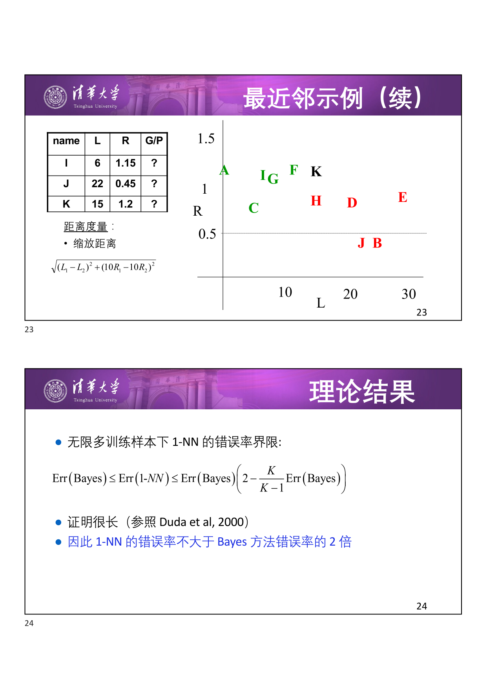

!!! abstract "定理 1（1-NN 的错误率界限）"

    在无限多训练样本下，1-NN 的错误率 $R_{\text{1NN}}$ 不大于 Bayes 方法错误率 $R_{\text{Bayes}}$ 的 2 倍：

    $$
    R_{\text{Bayes}} \le R_{\text{1NN}} \le R_{\text{Bayes}} \left( 2 - \frac{c}{c-1} R_{\text{Bayes}} \right) \le 2 R_{\text{Bayes}}
    $$

    其中 $c$ 为类别数。证明参照 Duda et al, 2000。

!!! info "Voronoi 图（维诺图）"

    最近邻（1-NN）的决策边界可以通过 **Voronoi Diagram** (沃罗诺伊图) 来解释。

    对于任意欧氏空间的离散点集合 $S$，以及几乎所有的点 $x$，$S$ 中一定有一个与 $x$ 最接近的点。边界上的点可能与两个或多个点距离相等。

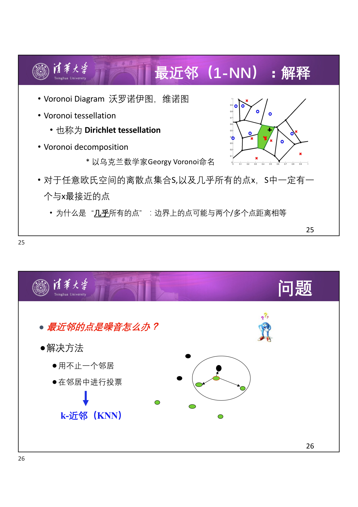

**问题** ：如果最近邻的点是噪音怎么办？只选取一个邻居评判，随机性太高，可能预测出错。

### 3.2 K-NN 基本思想

为了解决噪音问题， **K-近邻** (K-Nearest Neighbor, KNN) 算法的核心思想是：

- 使用不止一个邻居的标签。
- 选取前 $k$ 个最近的邻居进行 **投票** 。

???+ example "例 2：信用评分 (3-NN)"

    使用 $k=3$，以 David $(37, 50K, 2)$ 为待分类样例，计算欧氏距离：

    | 顾客 | 年龄 | 收入 (K) | 卡片数 | 结果 | 距 David 的距离 |
    |------|------|---------|--------|------|----------------|
    | John | 35 | 35 | 3 | No | $\sqrt{(35-37)^2+(35-50)^2+(3-2)^2} = 15.16$ |
    | Mary | 22 | 50 | 2 | Yes | $\sqrt{(22-37)^2+(50-50)^2+(2-2)^2} = 15$ |
    | Hannah | 63 | 200 | 1 | No | $\sqrt{(63-37)^2+(200-50)^2+(1-2)^2} = 152.23$ |
    | Tom | 59 | 170 | 1 | No | $\sqrt{(59-37)^2+(170-50)^2+(1-2)^2} = 122$ |
    | Nellie | 25 | 40 | 4 | Yes | $\sqrt{(25-37)^2+(40-50)^2+(4-2)^2} = 15.74$ |

    3 个最近邻为 Mary (Yes)、John (No)、Nellie (Yes)，投票结果为 **Yes** 。

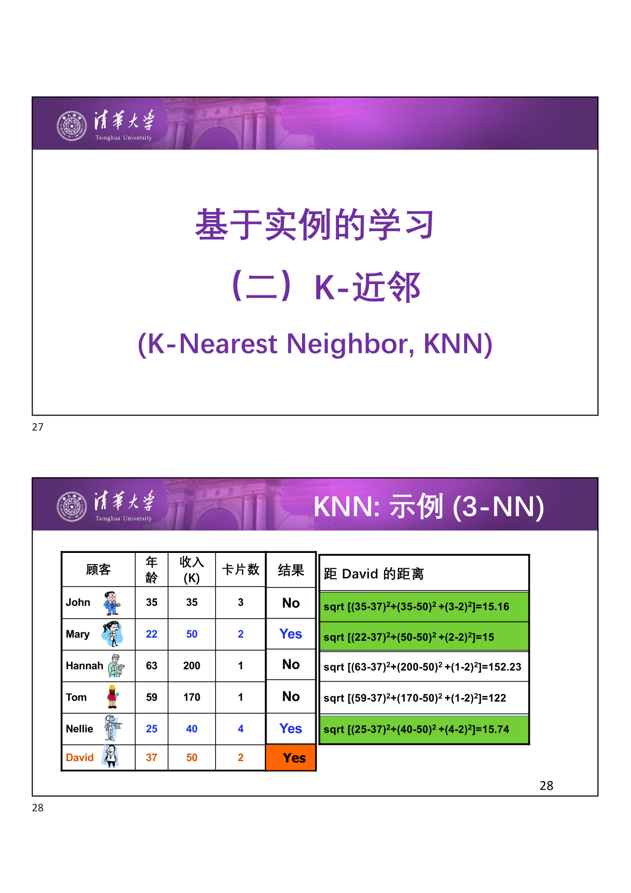

!!! warning "注意：距离的尺度问题"

    在上例中，收入的取值范围远大于年龄和卡片数，距离计算会被收入主导。这说明了 **归一化** 的必要性（见第 5 节）。

## 4 距离度量

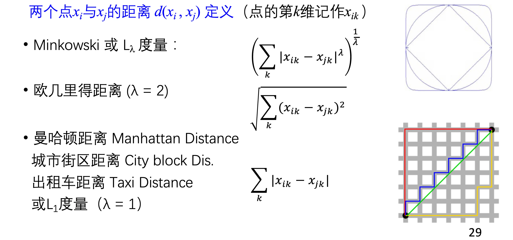

两个点 $x_i$ 与 $x_j$ 的距离 $d(x_i, x_j)$ 有多种定义方式（点的第 $k$ 维记作 $x_{ik}$）：

**Minkowski 或 $L_p$ 度量** ：

$$
d(x_i, x_j) = \left( \sum_k |x_{ik} - x_{jk}|^p \right)^{\frac{1}{p}}
$$

- $p=2$ 时为 **欧几里得距离** (Euclidean Distance)：$\sqrt{\sum_k (x_{ik} - x_{jk})^2}$
- $p=1$ 时为 **曼哈顿距离** (Manhattan Distance，城市街区距离 / 出租车距离)：$\sum_k |x_{ik} - x_{jk}|$
- $p \to \infty$ 时为 **切比雪夫距离** (Chebyshev Distance，棋盘距离)：$\max_k |x_{ik} - x_{jk}|$

**其他距离度量** ：

- **加权欧氏距离** (Weighted Euclidean Distance)：$\sqrt{\sum_k \frac{(x_{ik} - x_{jk})^2}{\sigma_k^2}}$
- **Bray-Curtis 距离** (相异度)：$\frac{\sum_k |x_{ik} - x_{jk}|}{\sum_k (x_{ik} + x_{jk})}$
- **Canberra 距离** ：$\sum_k \frac{|x_{ik} - x_{jk}|}{|x_{ik}| + |x_{jk}|}$

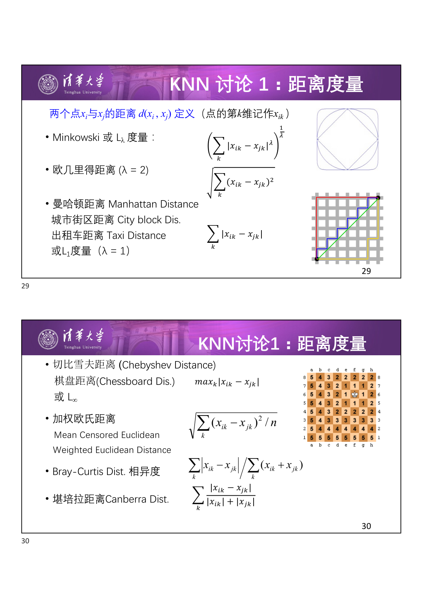

## 5 属性的处理

由于不同属性数值的取值范围可能差异很大（例如年龄在 0-100 之间，而收入在 10000-100000 之间），距离的计算可能被某些取值特别大的属性所 **支配** ，因此需要进行处理。

### 5.1 数值归一化

需要对各种属性进行 **数值归一化** (Normalization)，将数值映射到相近的区间（如 $[0, 1]$）。常用的方法有：

- **Min-Max 归一化** ：$x_i' = \frac{x_i - \min}{\max - \min}$
- **Log 缩放** 等

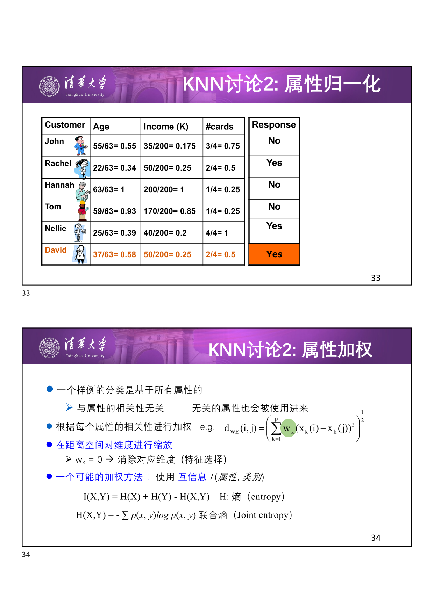

???+ example "例 3：归一化后的信用评分数据"

    对信用评分数据进行 Min-Max 归一化：

    | Customer | Age | Income (K) | cards | Response |
    |----------|-----|-----------|--------|----------|
    | John | 55/63 = 0.55 | 35/200 = 0.175 | 3/4 = 0.75 | No |
    | Rachel | 22/63 = 0.34 | 50/200 = 0.25 | 2/4 = 0.5 | Yes |
    | Hannah | 63/63 = 1 | 200/200 = 1 | 1/4 = 0.25 | No |
    | Tom | 59/63 = 0.93 | 170/200 = 0.85 | 1/4 = 0.25 | No |
    | Nellie | 25/63 = 0.39 | 40/200 = 0.2 | 4/4 = 1 | Yes |
    | David | 37/63 = 0.58 | 50/200 = 0.25 | 2/4 = 0.5 | Yes |

    归一化后各属性量纲一致，距离计算不再被收入支配。

### 5.2 属性加权

一个样例的分类是基于所有属性的，但无关的属性也会被计算在内。因此，可以根据每个属性的相关性进行 **加权** ：

- 基本加权：在距离计算中为不同维度乘以权重 $w_k$：

$$
d_w(x_i, x_j) = \sqrt{\sum_k w_k (x_{ik} - x_{jk})^2}
$$

- 若 $w_k = 0$，则等价于消除对应维度（ **特征选择** ）。
- **互信息** (Mutual Information)：一种可能的加权方法，使用属性和类别之间的互信息 $I(X, Y)$。

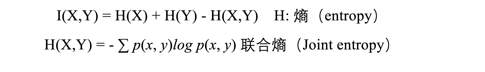

!!! note "互信息与熵"

    互信息定义为：

    $$
    I(X,Y) = H(X) + H(Y) - H(X,Y)
    $$

    其中 $H$ 为熵 (entropy)，联合熵 (Joint entropy) 为：

    $$
    H(X,Y) = -\sum p(x,y) \log p(x,y)
    $$

## 6 连续取值目标函数

KNN 算法可以处理不同的输出类型：

- **离散输出（分类）** ：统计 $k$ 个近邻然后进行 **投票** 即可。
- **连续输出（回归）** ：计算 $k$ 个近邻训练样例目标值的 **均值** 。

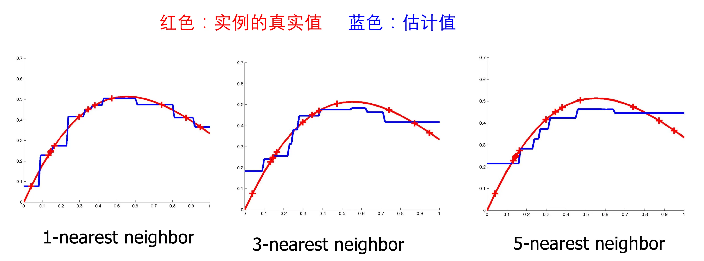

随着 $k$ 的增加，连续取值的估计曲线会变得更加 **平滑** （如上图中 1-NN 拟合较多细节，而 5-NN 更加平滑）。

## 7 K 的选择与打破平局

### 7.1 K 的选择

- 多数情况下 $k=3$。
- 通常选取 **奇数** ，以防止投票时出现平局。
- 更大的 $k$ 不一定带来更好的效果，取决于训练样例的数目。
- 实践中常通过 **交叉验证** (Cross-validation) 来选择合适的 $k$。例如 **Leave-one-out** ：每次拿一个样例作为验证，所有其他的作为训练样例。

!!! tip "KNN 的稳定性"

    KNN 算法相对稳定，样例中小的噪音或混乱不会对整体结果产生非常大的影响。

### 7.2 打破平局 (Break Ties)

如果出现平局（例如 $k=3$ 并且每个近邻都属于不同的类，或者票数相同）：

- 找一个新的邻居（例如看第 4 个邻居）。
- 取最近的邻居所属的类别。
- 随机选一个。

## 8 效率与 KD-Tree

**KNN** 算法把所有的计算放在新实例来到时，实时计算开销大。为了加速对最近邻居的选择，可以采用 **KD-Tree** 数据结构。

- **核心思想** ：先检验临近的点，忽略比目前找到的最近点更远的点。
- **KD-Tree** 是一种基于树的数据结构，递归地将 $k$ 维数据点划分到和坐标轴平行的方形区域内。

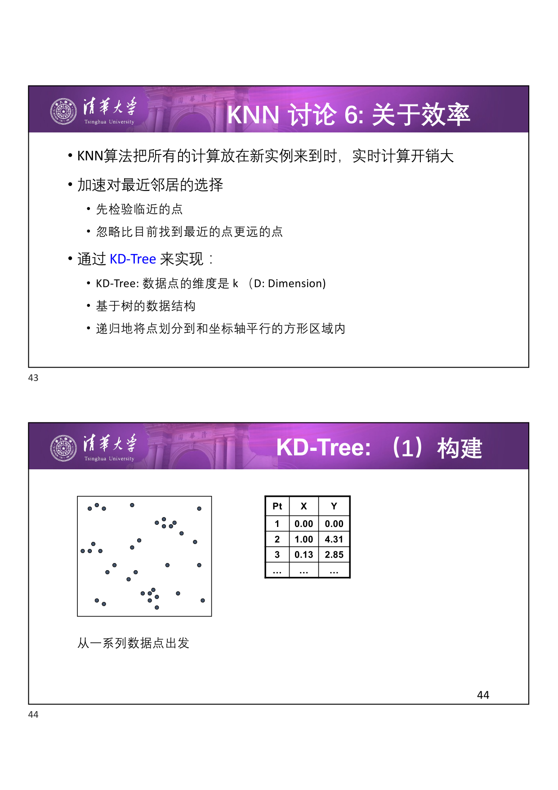

### 8.1 KD-Tree 的构建

用启发式的方法决定如何分割空间：

- **沿哪个维度分割？** 选择范围最宽的维度。
- **分割的值怎么取？** 取数据点在该分割维度的 **中位数** （保证树的平衡，而非均值）。
- **何时停止分割？** 当剩余的数据点少于 $m$，或者区域的宽度达到最小值。
- 每个叶节点维护一个额外信息：该节点下所有数据点的 **紧边界** 。

构建过程如下图所示：首先选择一个维度和分界值将数据点分为两组，然后递归地对每组继续分割，最终构建树形结构，每个叶节点是一系列数据点的列表。

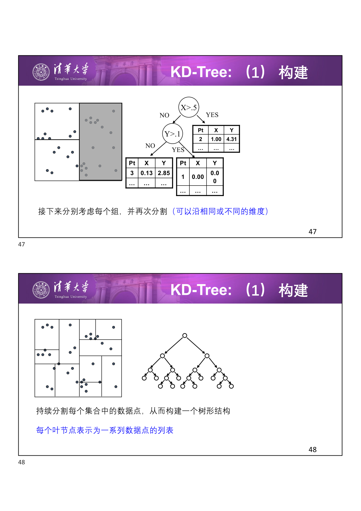

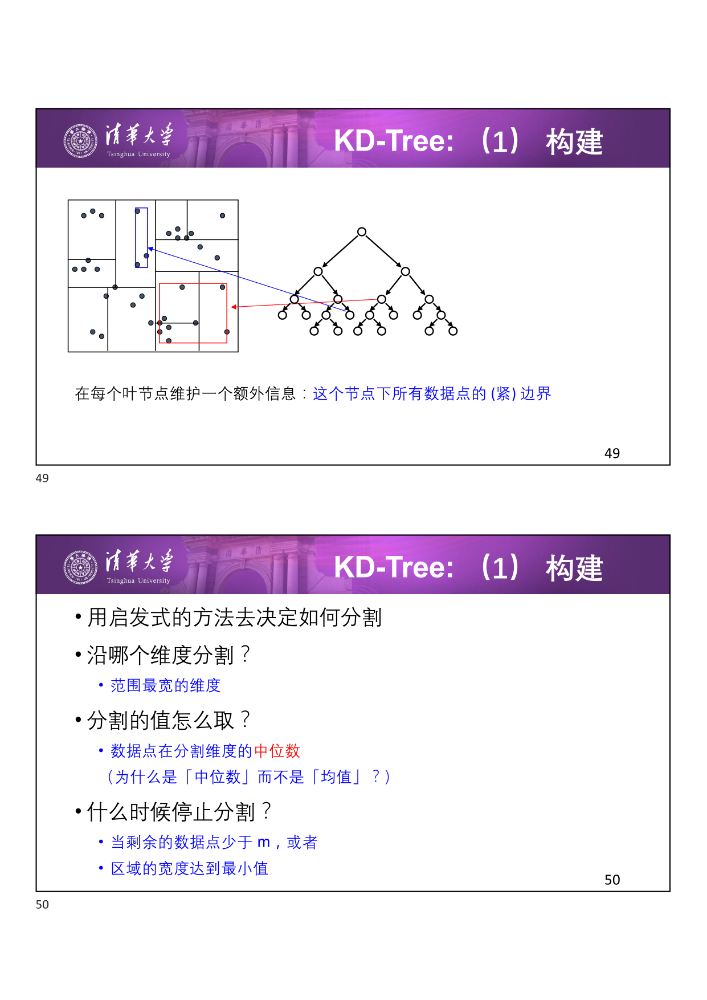

### 8.2 KD-Tree 的查询

查询过程分为以下步骤：

**Step 1** ：遍历树，关注距离查询数据点 **最近的分支** 。

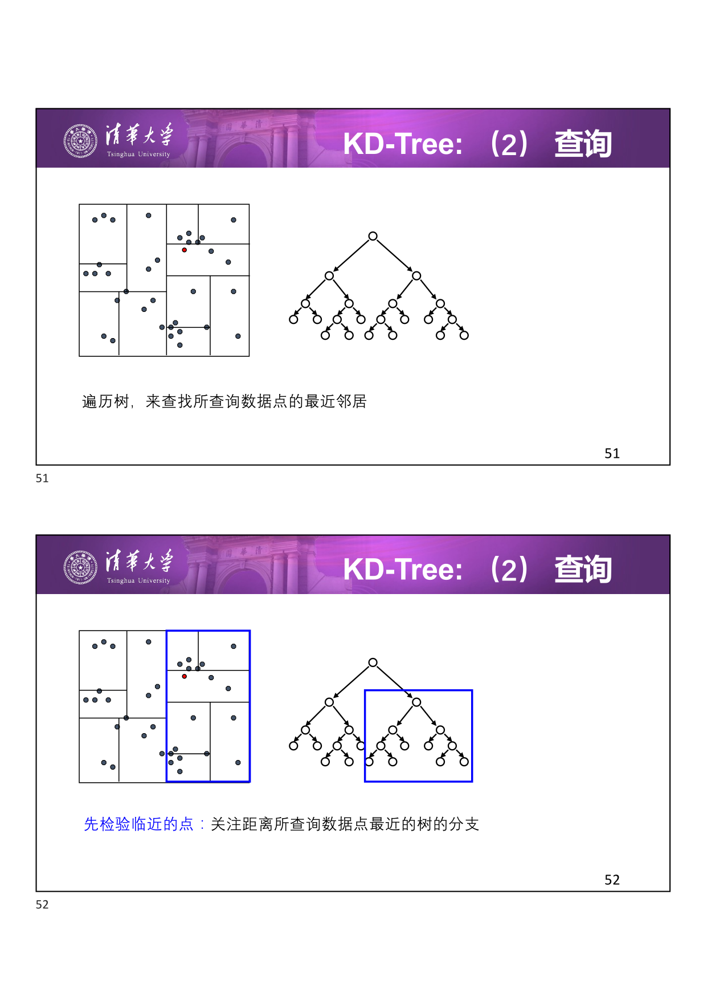

**Step 2** ：到达叶节点后，计算节点中每个数据点与目标点的距离，并更新当前的 **最近距离** （上界）。

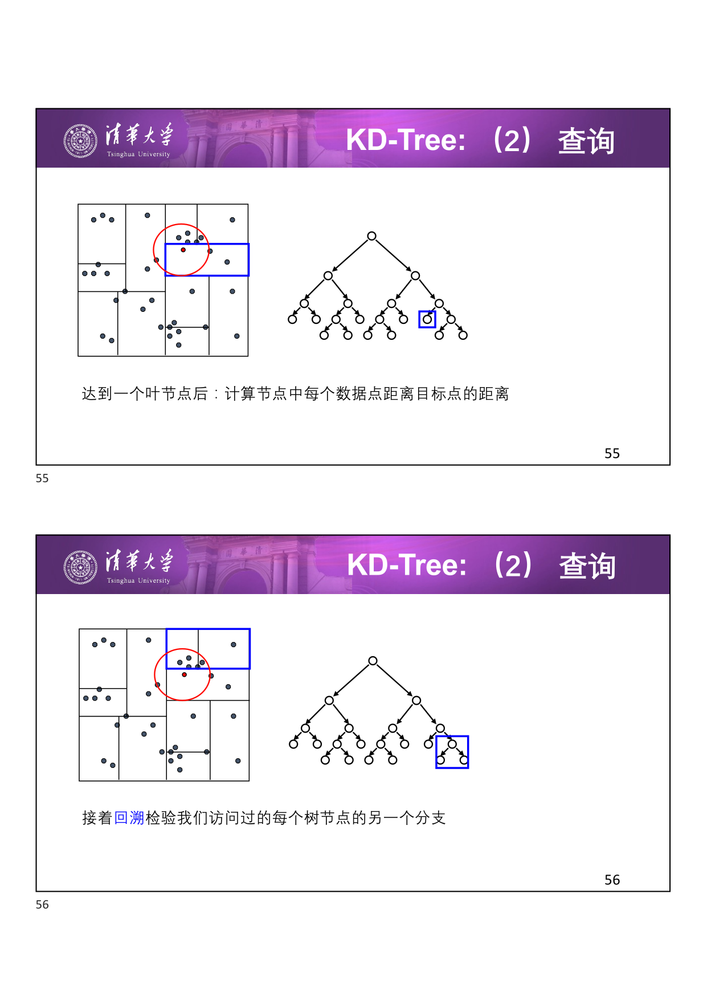

**Step 3** ：回溯检验访问过的每个树节点的另一个分支。每找到一个更近的点，就更新距离上界。

**Step 4** ：利用当前的最近距离以及每个树节点下数据的边界信息，对不可能包含最近邻居的分支进行 **剪枝** 。

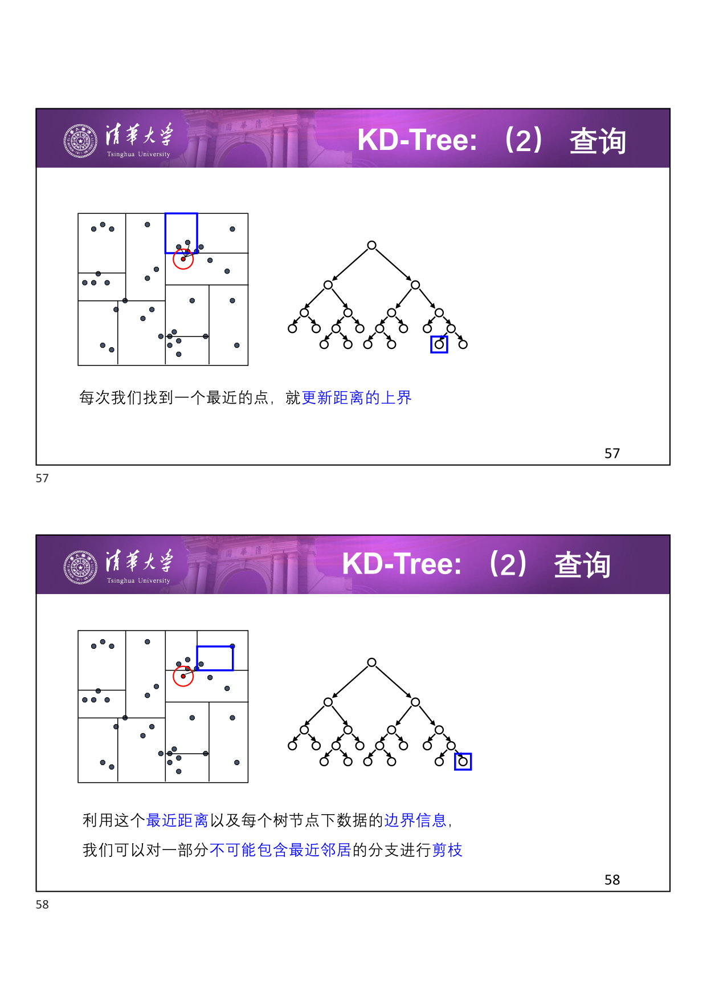

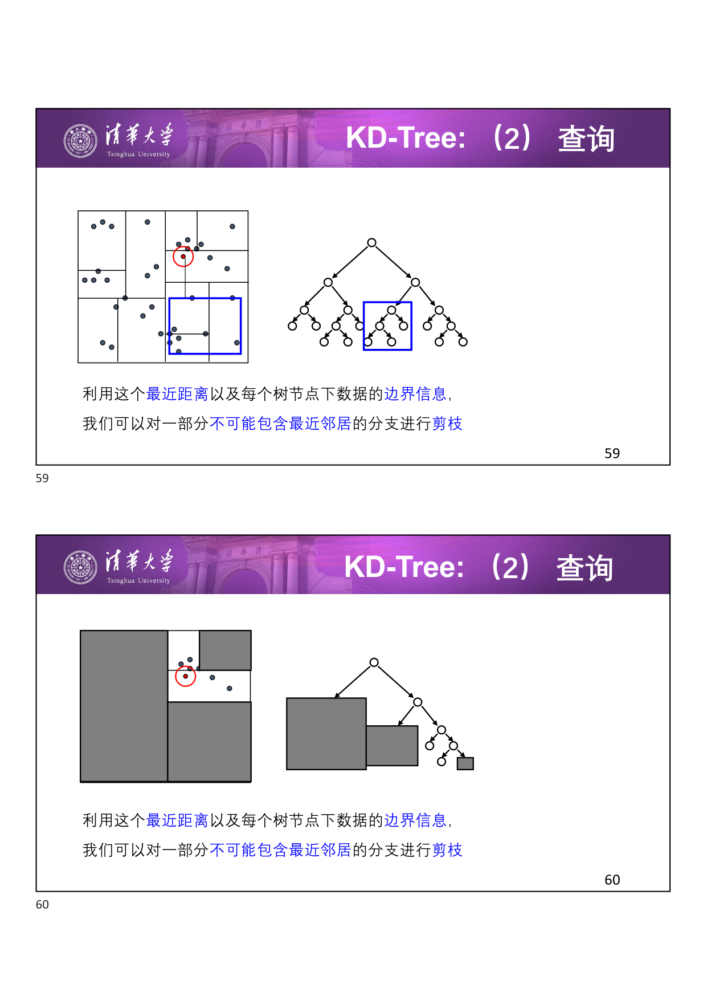

## 9 总结

**KNN** 算法的优缺点总结如下：

- **优点** ：
    - 概念简单，但可以处理复杂问题（如图片分类）和复杂的目标函数。
    - 通过对 $k$ 近邻的平均，对噪声数据更 **鲁棒** 。
    - 容易理解，预测结果可解释（可以展示最近邻居）。
    - 训练样例的信息不会丢失（样例本身被显式地存储下来）。
    - 实现简单、稳定、除了 $k$ 之外没有参数。
    - 方便进行 Leave-one-out 验证。

- **缺点** ：
    - **内存开销大** ：需要大量空间存储所有样例。通常需存储任意两点距离 $O(n^2)$，KD-Tree 为 $O(n \log n)$。
    - **CPU 开销大** ：分类新样本需要较多时间（因此多用在离线场景）。
    - 很难确定合适的距离函数（尤其是复杂符号表示时）。
    - 不相关的特征对距离的度量有负面影响。

## 10 距离加权的 K 近邻算法

### 10.1 动机

在标准 KNN 中，$k$ 个邻居的贡献是 **一样的** ——无论它们距离查询点远近，投票权重相同。但直觉上， **更接近** 查询数据点的邻居应当赋予 **更大的权重** 。

### 10.2 加权函数

距离加权 KNN 引入一个 **核函数** $K(\cdot)$ 来决定每个邻居的权重：

$$
w_i = K(d(x_i, x_q))
$$

其中 $d(x_i, x_q)$ 为查询数据点与 $x_i$ 之间的距离，$K(\cdot)$ 为核函数，应当与距离 $d$ **成反比** 。

**输出** 为加权平均：

$$
\hat{y} = \frac{\sum_i w_i y_i}{\sum_i w_i}
$$

常用的核函数包括：

- $K(d) = 1 / d^2$
- $K(d) = e^{-d}$
- $K(d) = 1 / (1 + d)$
- $K(d) = e^{-(d/\sigma_0)^2}$（高斯核）

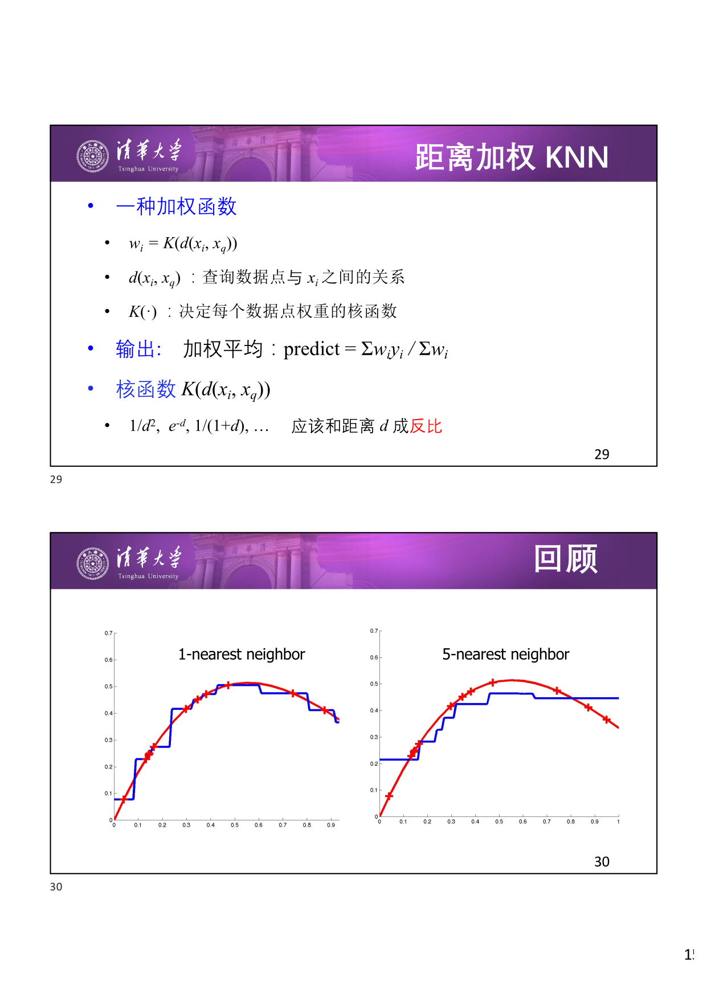

### 10.3 不同核函数的效果对比

下图展示了三种不同核函数在回归任务上的表现：

- $W_i = 1 / d(x_q, x_i)^2$：简单的距离平方反比
- $W_i = 1 / (d_0 + d(x_q, x_i))^2$：加入平滑常数 $d_0$ 避免距离为零时的奇异性
- $W_i = e^{-(d(x_q, x_i) / \sigma_0)^2}$：高斯核，效果更加光滑

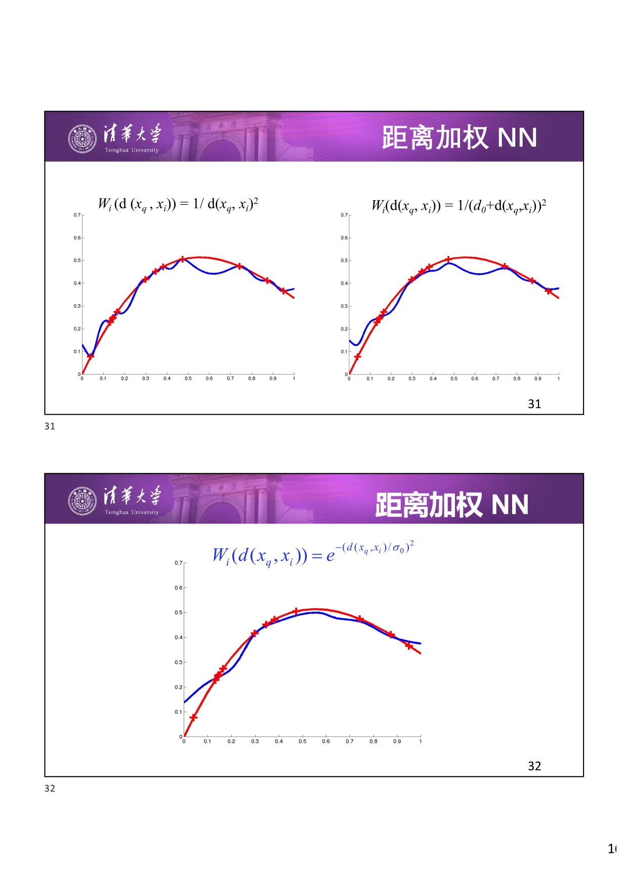

### 10.4 距离加权 KNN 的四要素描述

用基于记忆的学习器的四要素框架来描述距离加权 KNN：

1. **距离度量** ：缩放的欧式距离
2. **使用多少个邻居** ：所有的，或 $K$ 个
3. **加权函数** ：$w_i = \exp(-D(x_i, \text{query})^2 / K_w^2)$，其中 $K_w$ 为 **核宽度** ，非常重要
4. **如何使用邻居** ：每个输出的加权平均 $\hat{y} = \sum w_i y_i / \sum w_i$

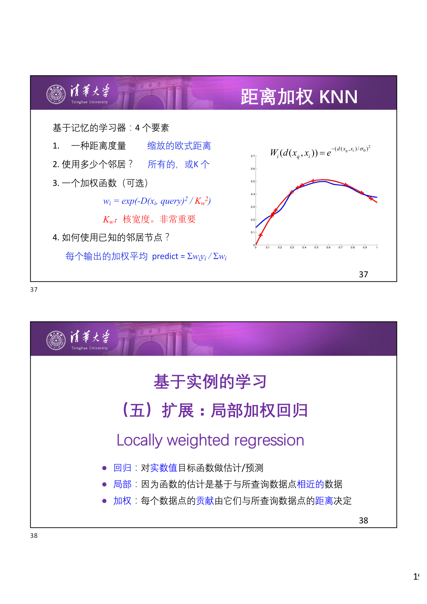

## 11 基于实例的学习器的四个要素

所有基于实例（记忆）的学习器都可以用以下 **四个要素** 来刻画：

1. 一种 **距离度量**
2. 使用多少个 **邻居** ？
3. 一个 **加权函数** （可选）
4. 如何使用已知的 **邻居节点** ？

不同算法在四要素框架下的对比：

| 要素 | 1-NN | K-NN | 距离加权 KNN | 局部加权回归 |
|------|------|------|-----------|---------|
| 距离度量 | 欧式距离 | 欧式距离 | 缩放的欧式距离 | 缩放的欧式距离 |
| 邻居数量 | 1 个 | $K$ 个 | 所有的或 $K$ 个 | 所有的或 $K$ 个 |
| 加权函数 | 无 | 无 | $w_i = \exp(-D^2 / K_w^2)$ | $w_i = \exp(-D^2 / K_w^2)$ |
| 使用方式 | 与邻居相同 | $K$ 个邻居投票 | 加权平均 | 构建局部线性模型 |

## 12 局部加权回归

### 12.1 基本思想

**局部加权回归** (Locally Weighted Regression) 是基于实例学习的进一步扩展：

- **回归** (Regression)：对 **实数值** 目标函数做估计/预测
- **局部** (Local)：函数的估计是基于与查询数据点 **相近** 的数据
- **加权** (Weighted)：每个数据点的贡献由它们与查询数据点的 **距离** 决定

与距离加权 KNN 的区别在于第四个要素——局部加权回归不是简单地对邻居取加权平均，而是在查询点附近 **构建一个局部线性模型** 。

### 12.2 算法

给定查询点 $x_q$，拟合参数 $\beta$ 以最小化局部的加权平方误差和：

$$
\beta = \arg\min_{\beta} \sum_i w_i (y_i - \beta^T x_i)^2
$$

其中权重 $w_i = \exp(-D(x_i, \text{query})^2 / K_w^2)$，$K_w$ 为核宽度。

预测值为：

$$
\hat{y} = \beta^T x_q
$$

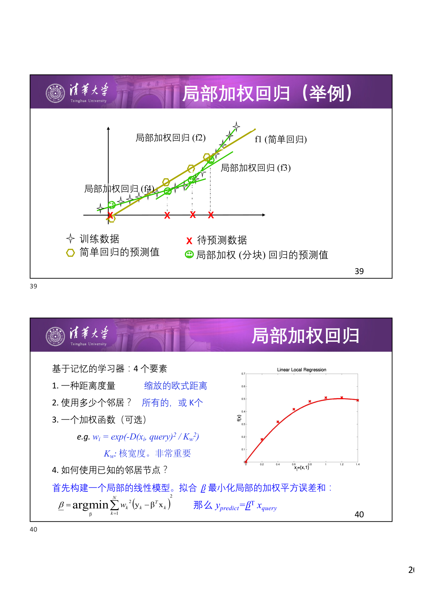

!!! warning "核宽度的选择"

    核宽度 $K_w$ 的选择非常重要，不仅是对核回归，对 **所有局部加权学习器** 都很重要。$K_w$ 太小会导致过拟合和抖动，$K_w$ 太大会导致欠拟合。

## 13 真实数据上不同算法的表现对比

以下展示了在三组不同特征的真实测试数据上，各种算法的表现：

### 13.1 线性回归

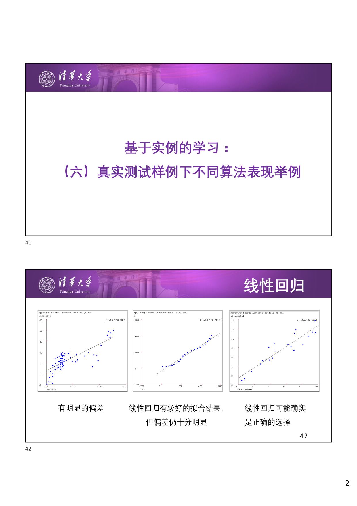

- 数据 1：有明显的偏差
- 数据 2：线性回归有较好的拟合结果，但偏差仍十分明显
- 数据 3：线性回归可能确实是正确的选择

### 13.2 连接所有点 & 1-近邻

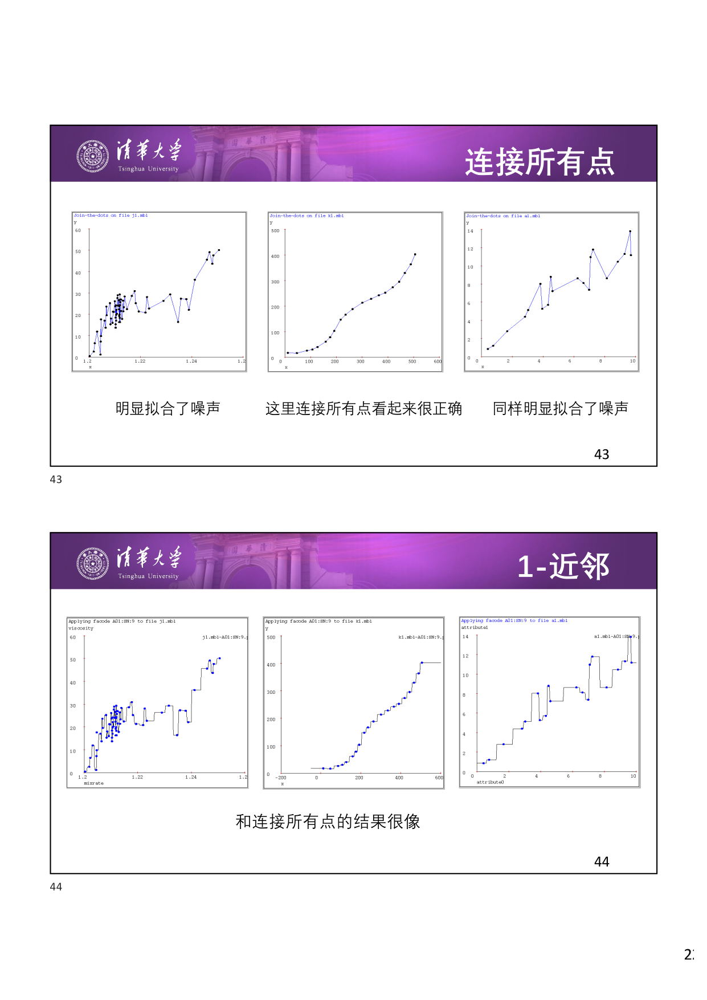

- **连接所有点** ：明显拟合了噪声（数据 1、3），只在数据 2 上看起来很正确
- **1-近邻** ：和连接所有点的结果很像，同样容易拟合噪声

### 13.3 K-近邻 (K=9) & 距离加权 KNN

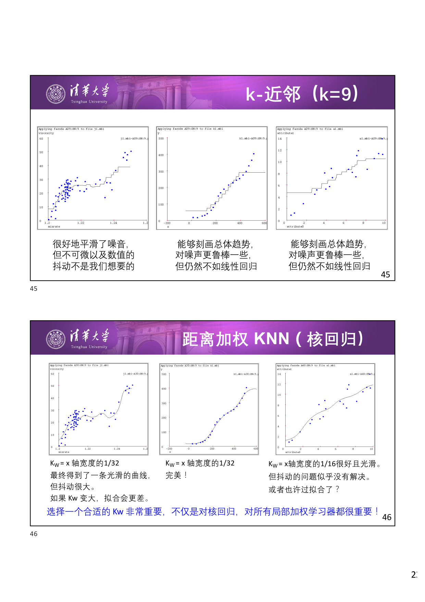

- **K-近邻 (K=9)** ：很好地平滑了噪音，能够刻画总体趋势，对噪声更鲁棒。但曲线不可微且有数值抖动
- **距离加权 KNN（核回归）** ：
    - $K_w$ = x 轴宽度的 1/32：得到光滑曲线，但抖动很大
    - $K_w$ 的选择非常重要：太小抖动大，太大拟合差

### 13.4 局部加权回归

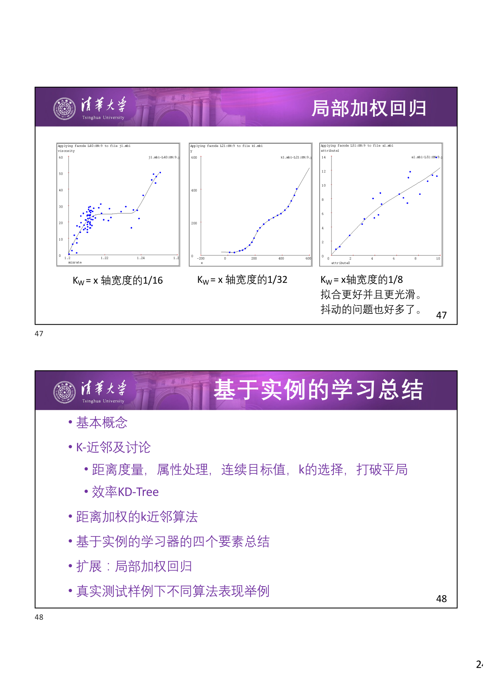

- $K_w$ = x 轴宽度的 1/8：拟合更好并且更光滑，抖动的问题也好多了
- 总体上，局部加权回归在多种数据特征下表现 **最稳定** ，兼顾了光滑性和拟合精度
