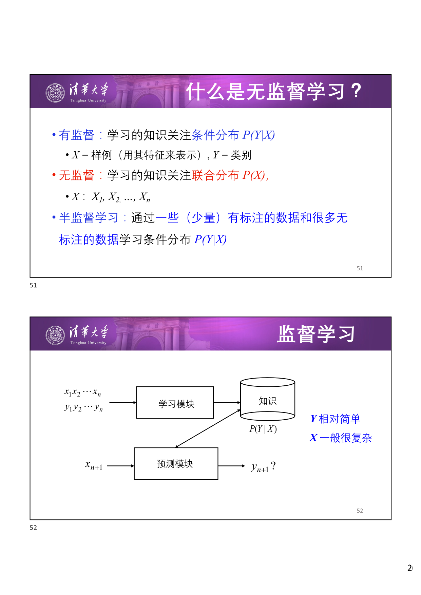
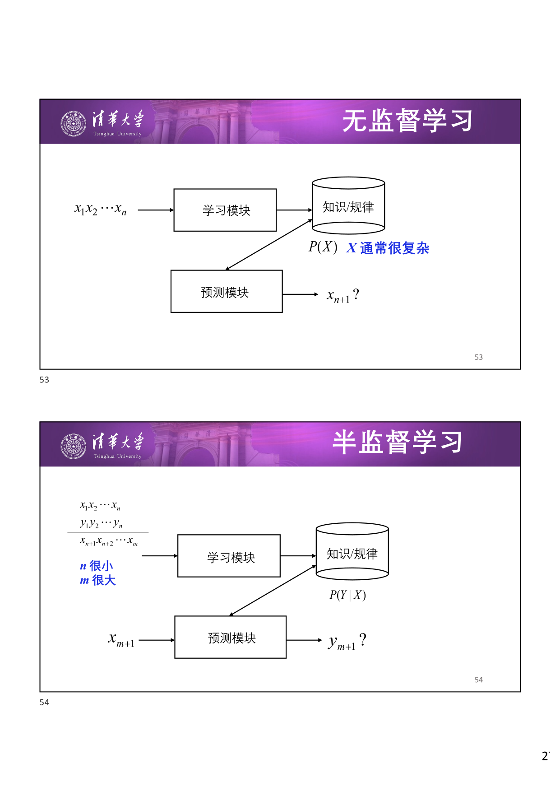
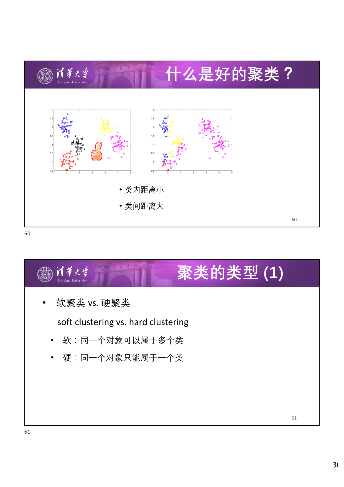
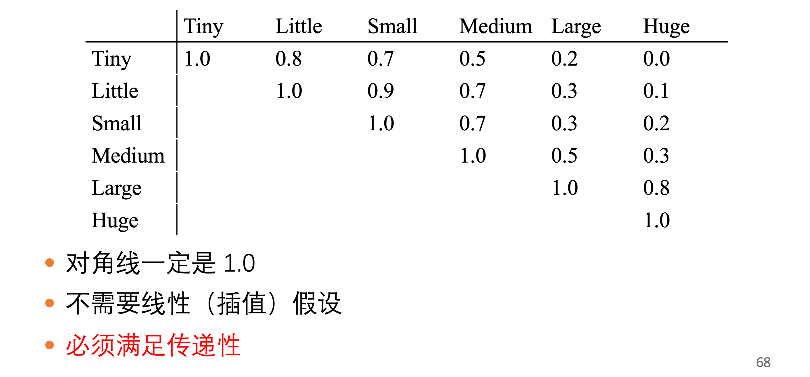
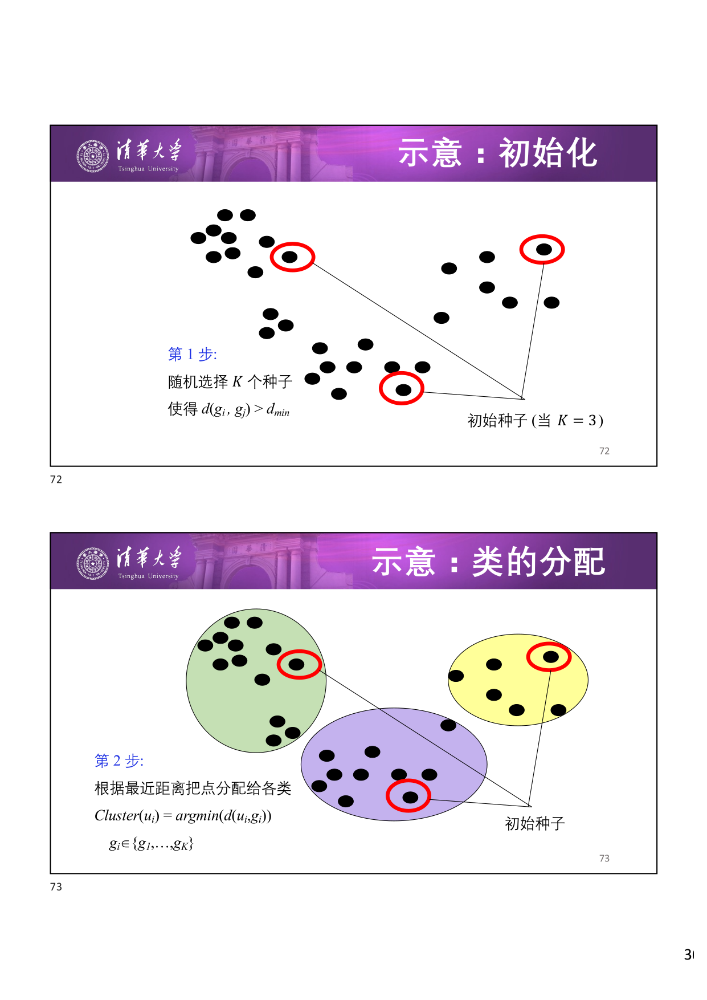
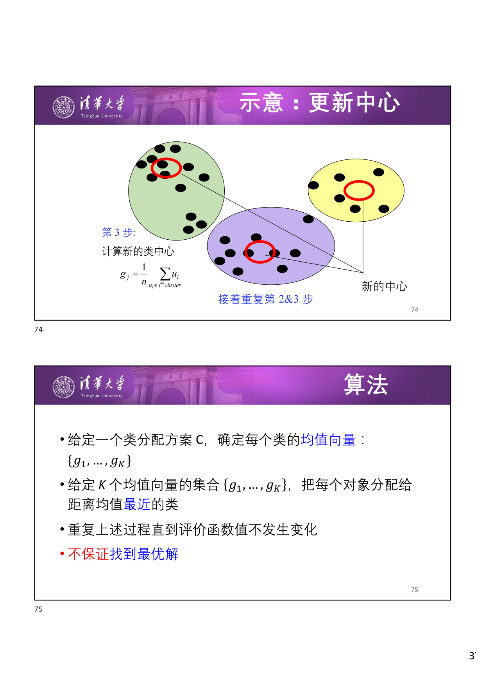
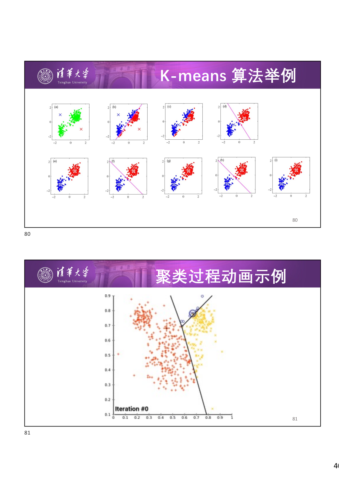
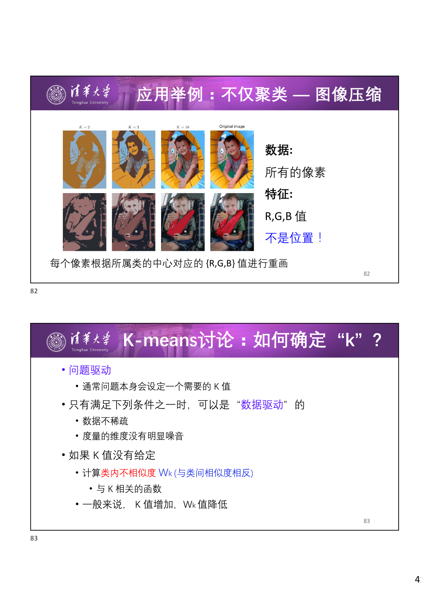
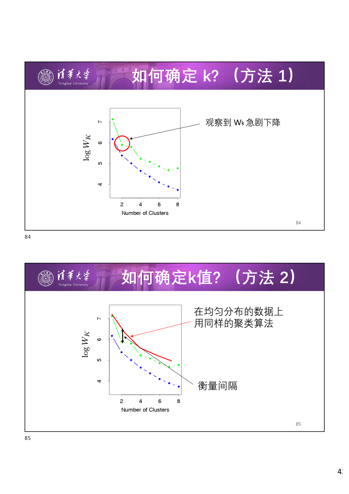

# 无监督学习与 K-means 聚类

## 1 无监督学习介绍

### 1.1 有监督 vs 无监督 vs 半监督

三种学习范式的核心区别在于学习目标和可用数据：

- **有监督学习** (Supervised Learning)：学习的知识关注 **条件分布** $P(Y \mid X)$，其中 $X$ 为样例（用特征表示），$Y$ 为类别。$Y$ 相对简单，$X$ 一般很复杂。
- **无监督学习** (Unsupervised Learning)：学习的知识关注 **联合分布** $P(X)$，其中 $X$：$X_1, X_2, \dots, X_n$。没有标签信息，$X$ 通常很复杂。
- **半监督学习** (Semi-supervised Learning)：通过 **少量** 有标注的数据和 **大量** 无标注的数据学习条件分布 $P(Y \mid X)$。

下图展示了无监督学习和半监督学习的框架对比：

### 1.2 无标注数据可以用来做什么？

数据的结构蕴含极为重要的信息——即使没有标签，数据本身的分布和结构也包含丰富的知识。无标注数据的主要用途包括：

- **数据聚类** (Clustering)：在 **没有预先定义的类别时** 将数据分为不同的组
- **降维** (Dimensionality Reduction)：减少所需要考虑的变量数量
- **离群点检测** (Outlier Detection)：识别错误噪声，发现机器学习系统在训练中未意识到的新数据/信号
- **刻画数据密度** (Density Estimation)
- **发现数据中隐含的规律**

## 2 聚类介绍

### 2.1 什么是聚类？

**聚类** (Clustering) 是将 **相似的对象** 归入同一个"类"的过程——"物以类聚，人以群分" (Birds of a feather flock together)。

目标是使得同一个类中的对象互相之间 **关联更强** ：

- 同一个类中的对象 **相似**
- 不同类中的对象有 **明显差异**

核心问题在于 **相似度定义** ：

- **簇/类内** (intra-cluster) 相似度
- **簇/类间** (inter-cluster) 相似度

!!! abstract "定义 1（好的聚类）"

    一个好的聚类应当满足：

    - **类内距离小** ：同一个类中的对象尽可能相似
    - **类间距离大** ：不同类中的对象尽可能不同

### 2.2 聚类的类型

**按分配方式分** ：

- **软聚类** (Soft Clustering)：同一个对象可以属于 **多个** 类
- **硬聚类** (Hard Clustering)：同一个对象只能属于 **一个** 类

**按结构分** ：

- **层次聚类** (Hierarchical)：类之间形成一个 **层次结构** （树状结构）
- **非层次聚类** (Non-hierarchical)：扁平的，只有一层

### 2.3 聚类的应用

- **生物学** ：将同源序列分组到基因家族中；基因数据的相似度用于预测种群结构
- **图像处理** ：如自动相册中的"人物"分组
- **经济** ：市场商务智能，如找到不同的顾客群体（保险等）
- **WWW** ：文档/事件聚类（如每周新闻摘要）；Web 日志分析（发现相似的用户和访问模式）

### 2.4 聚类需要什么？

- 无标注数据
- 对象间的 **距离或相似度度量**
- （有时需要）类间的距离或相似度度量
- 聚类算法（K-means、K-medoids、层次聚类等）

## 3 相似度度量

### 3.1 数据表示

数据以向量形式表示：$x \in D_1 \times D_2 \cdots \times D_N$，每个维度的类型可以是：

- **实数** (Real)：$D = \mathbb{R}$
- **二值** (Binary)：$D = \{v_1, v_2\}$，如 $\{\text{Female}, \text{Male}\}$
- **非数值** (Nominal)：$D = \{v_1, v_2, \dots, v_M\}$，如 $\{\text{Mon}, \text{Tue}, \dots, \text{Sun}\}$
- **有序值** (Ordinal)：$D = \mathbb{R}$ 或 $D = \{v_1, v_2, \dots, v_M\}$，顺序很重要，如排名

### 3.2 实数值数据的相似度

**相似度与距离成反比** 。常用度量包括：

- **内积**
- **余弦相似度**
- **基于核的相似度**
- **Minkowski 距离** （回顾 [K 近邻](../K%20%E8%BF%91%E9%82%BB/) 中的距离度量）：Manhattan 距离、Euclidean 距离、Chebyshev 距离等

### 3.3 非数值数据的相似度

对于非数值数据（如 "Boston"、"LA"、"Pittsburgh" 或 "男"、"女"）：

- **二值匹配** ：若 $x_i = x_j$，则 $\text{sim}(x_i, x_j) = 1$，否则为 $0$
- **语义属性** ：如 $\text{Sim}(\text{Boston}, \text{LA}) = d_{\text{air}}(\text{Boston}, \text{LA})^{-1}$
- **相似度矩阵** ：预先定义所有取值对之间的相似度

!!! info "相似度矩阵的性质"

    相似度矩阵具有以下特点：

    - 对角线一定是 $1.0$
    - 不需要线性（插值）假设
    - 必须满足传递性

### 3.4 有序值数据的相似度

对于有序值数据（如 "小"、"中"、"大"、"特大"）：

1. **归一化** 成 $[0, 1]$ 间的实数值：$\max(v) = 1$，$\min(v) = 0$，其他进行插值
2. 然后使用实数值变量的相似度度量
3. 也可以使用相似度矩阵

## 4 K-means 聚类

### 4.1 算法思想

K-means 是一种经典的 **非层次硬聚类** 算法，核心思想是：

1. 给定一个类分配方案 $C$，确定每个类的 **均值向量** ：$\{g_1, \dots, g_K\}$
2. 给定 $K$ 个均值向量的集合 $\{g_1, \dots, g_K\}$，把每个对象分配给距离均值 **最近** 的类
3. **重复** 上述过程直到评价函数值不发生变化
    - 这里：为什么要 **重复** ？
    - 因为每次分配对象的时候，也会 **同时** 调整均值向量

### 4.2 算法步骤图示

**第 1 步：初始化** —— 随机选择 $K$ 个种子点，使得 $d(g_i, g_j) > d_{\min}$。

**第 2 步：类的分配** —— 根据最近距离把点分配给各类：

$$
\text{Cluster}(u_i) = \arg\min_{g_i \in \{g_1, \dots, g_K\}} d(u_i, g_i)
$$

**第 3 步：更新中心** —— 计算新的类中心：

$$
g_v = \frac{1}{|v|} \sum_{u_i \in \text{Cluster}_v} u_i
$$

接着重复第 2 和第 3 步，直到收敛。

!!! warning "注意"

    K-means **不保证找到最优解** ，只能收敛到局部最优。

### 4.3 收敛性分析

!!! abstract "定理 1（K-means 的收敛性）"

    K-means 算法的代价函数 $J$ 在每次迭代中单调递减，因此算法一定会收敛。

**问题形式化** ：用 $u_1, \dots, u_n$ 表示数据，其中 $u_i \in \mathbb{R}^D$；用 $g_v$ 表示类 $v$ 的均值，其中 $v = 1, \dots, K$。对每个数据点 $u_i$，引入二值指示变量 $r_{iv} \in \{0, 1\}$：

- $r_{iv} = 1$ 表示 $u_i$ 属于类 $v$
- $r_{iv} = 0$ 表示 $u_i$ 不属于类 $v$
- 约束：$r_{i, \cdot} = (0, \dots, 0, 1, 0, \dots, 0)$（只有一个元素为 1）

**目标函数** ：最小化所有点到对应类中心的平均距离：

$$
J = \sum_{i} \sum_{v} r_{iv} \| u_i - g_v \|^2
$$

**优化策略** ：变量 $r_{iv}$ 和 $g_v$ 是耦合的，采用 **交替优化** 直到收敛：

- **步骤 (a)** ：固定 $g_v$，优化 $r_{iv}$ —— 将每个点分配给最近的类中心
- **步骤 (b)** ：固定 $r_{iv}$，优化 $g_v$ —— 更新类中心为类内所有点的均值

??? note "证明"

    步骤 (a) 中，固定 $g_v$ 后，每个 $r_{iv}$ 的最优解为将 $u_i$ 分配到距离最近的 $g_v$ 对应的类，这一步使得 $J$ 不增。

    步骤 (b) 中，固定 $r_{iv}$ 后，对 $g_v$ 求导令其为零：

    $$
    g_v = \frac{\sum_{i} r_{iv} u_i}{\sum_{i} r_{iv}}
    $$

    即类内所有点的均值，这一步也使得 $J$ 不增。

    因此 $J$ 在每次迭代中单调递减。又因为 $J \geq 0$，所以算法一定收敛。 $\square$

### 4.4 K-means 算法特性小结

| 特性   | 描述           |
| ---- | ------------ |
| 模型   | 向量空间模型       |
| 策略   | 最小化类内对象的欧氏距离 |
| 算法   | 迭代           |
| 聚类类型 | 硬聚类          |
| 结构类型 | 非层次          |

### 4.5 应用举例

**K-means 聚类示例** ：

**图像压缩** ：K-means 不仅可以用于数据分析，还可以用于图像压缩。将每个像素的 RGB 值作为特征（不是位置！），对所有像素进行聚类，然后用所属类中心的 RGB 值替换原始像素值，从而实现压缩。

### 4.6 如何确定 K？

当 $K$ 值没有由问题本身给定时，需要通过数据驱动的方式确定。基本思路：计算 **类内不相似度** $W_K$（与类间相似度相反），它是关于 $K$ 的函数，一般 $K$ 值增加，$W_K$ 值降低。

!!! tip "数据驱动确定 K 的前提条件"

    只有满足以下条件之一时，才可以使用数据驱动方法：

    - 数据不稀疏
    - 度量的维度没有明显噪音

**方法 1：肘部法则** (Elbow Method) —— 观察 $W_K$ 随 $K$ 变化的曲线，找到 $W_K$ **急剧下降** 的拐点。

**方法 2：间隔统计** (Gap Statistic) —— 在 **均匀分布** 的数据上用同样的聚类算法计算 $W_K$，然后衡量真实数据与均匀数据之间 $W_K$ 的 **间隔** ，间隔最大的 $K$ 即为最佳值。

### 4.7 K-means 讨论

!!! tip "K-means 的适用场景"

    当数据呈几个 **紧凑且互相分离** 的云状时效果很好。

!!! warning "K-means 的局限性"

    - 对于 **非凸边界** 的类或类大小非常不一致的情况，效果可能不佳
    - 对 **噪声和离群点** 非常敏感
