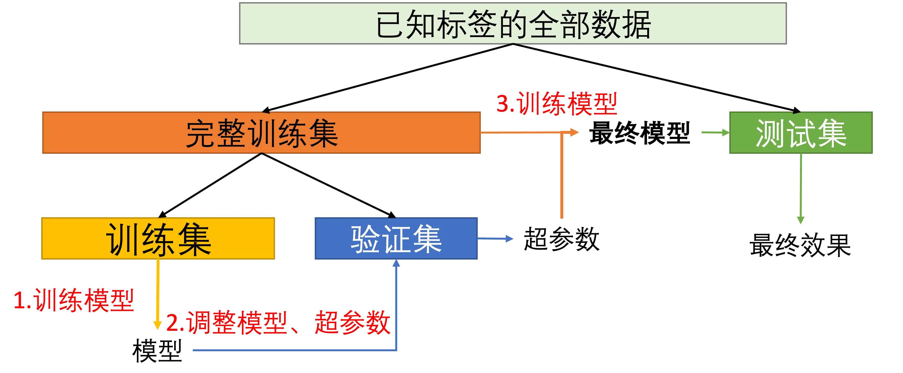
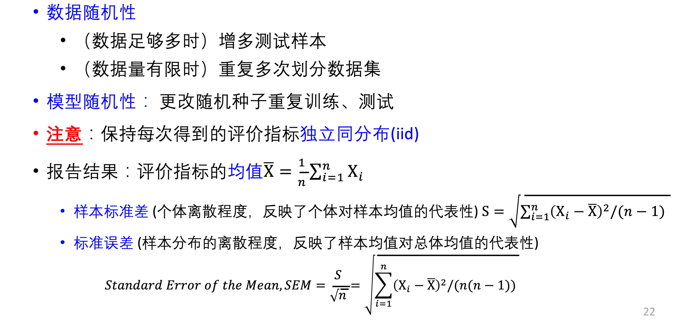

# 机器学习实验方法与原则

## 训练集、验证集与测试集

- 训练集：模型可见的样本标签
    - 需要小心 **过拟合问题**
- 未见样本：无穷多个
- 测试集：评估模型在 **未见样本** 上的表现
    - 尽可能与训练集 **互斥**
- 训练集与测试集的划分方式：

- **验证集**
    - 从 **训练集** 中额外分出来的，用于 ==超参数== 的调整
        - 如训练轮次，正则化权重，学习率等
    - 不在训练集上调整超参数的原因：
        - 防止 **过拟合训练集**

## 随机重复实验

- 这里的随机重复实验，主要针对：模型在测试集上的表现情况
- 为了得到模型较为真实的性能，需要随机重复实验

