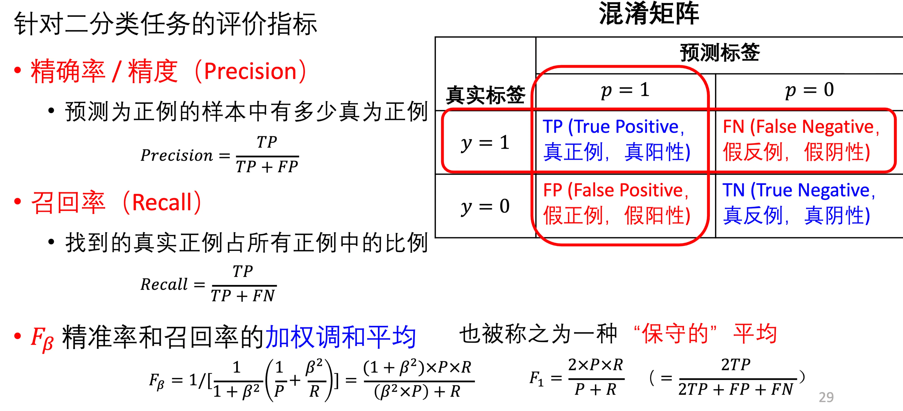
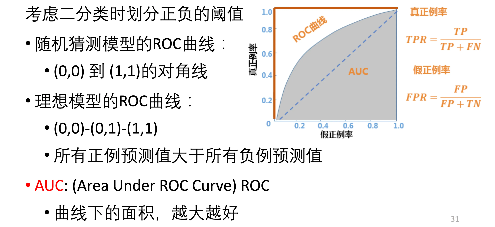
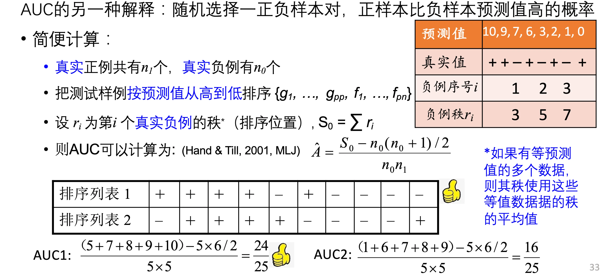

# 机器学习的评价指标

## 回归任务的评价指标

- 平均绝对误差（MAE）
- 均方误差（MSE）
- 均方根误差（RMSE）

## 分类任务

- 准确率 / 正确率：预测正确的比例
    - 这里的正确既包括：对的预测为对的，也包括错的预测为错的
    - 错误率：$1 - $ 正确率
- 精确率 / 精度：预测为正例的中，有多少 **确实** 正例
- 召回率：找到的 **真实正例** 占 **所有正例** 的比例
- $F_{\beta}$：精确率和召回率的加权调和平均

## ROC 曲线

- 模型在二分类的时候，会输出一个 **概率** ，需要划定 **阈值**
    - 一般通过这个阈值来确定是 **正例还是负例**
    - ROC 曲线就是取不同的阈值，统计 ==真正例率和假正例率== ，作为横纵坐标
- 真正例率：
    - 也就是 **召回率** ，找到的真实正例占所有正例的比率
    - 所有真实为正的里面，被正确判断为正的
- 假正例率：
    - 找到的 **真实假例（也就是假正例）** 占所有假例的比率
    - 所有真实为负的里面，错判为正的
- 一般随着阈值：
    - 增加：假正例率减少，真正例率也减少
    - 减少：假正例率增加，真正例率也增加

- AUC：
    - ROC 曲线下的面积大小
    - AUC 越大越好
- AUC 的另一种解释：
    - 随机选取一对正负样本，正样本 **预测值** 比负样本高的概率
    - 计算方法：

