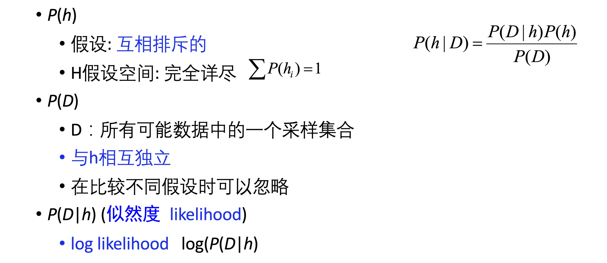
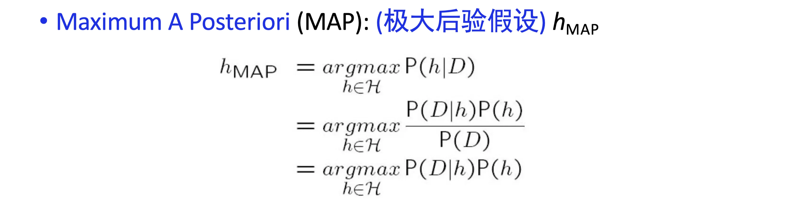
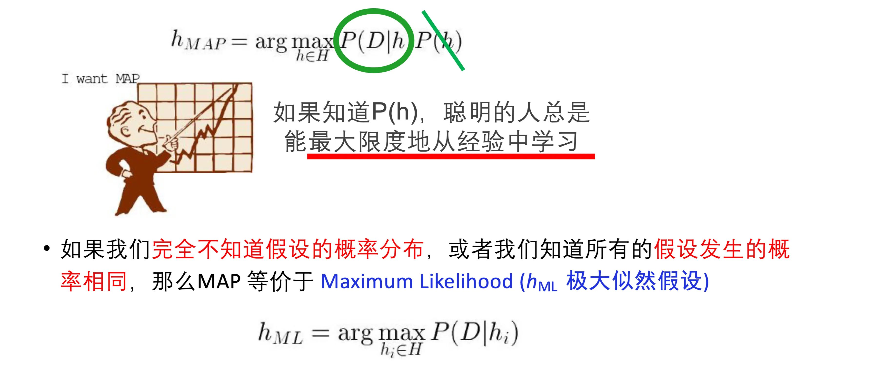
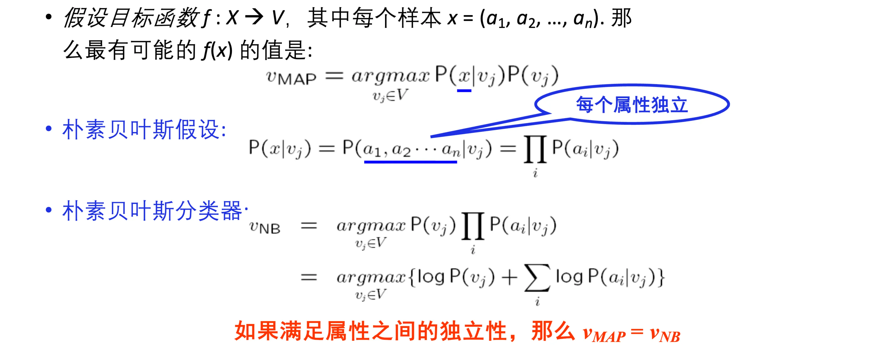
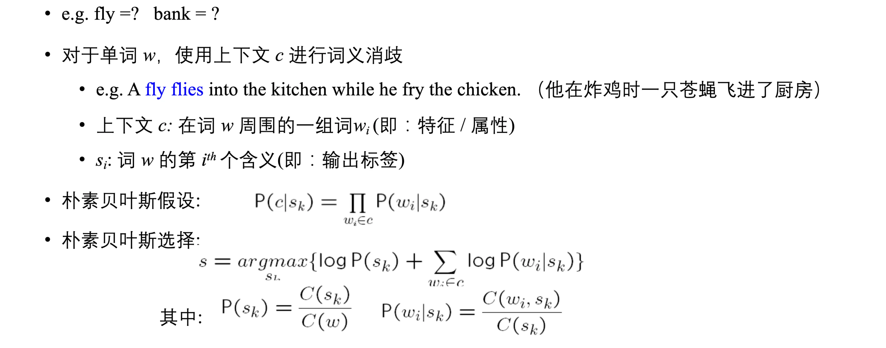

# 贝叶斯学习

## 基本思想

- 用 **先验知识** 帮助 **后验预测** ：
    - 就比如拼音输入法：
    - "你"后面接"好"的概率远远大于"号"，因此预测为好
    - 先验得到的概率是通过数据训练出来的

- 这张图片的解释：
    - $h$ 代表：不同的假设，我们假定它是 **互斥** 的
    - $D$ 代表：已知的条件
    - 后验概率：$P(h \mid D) = P(D \mid h) P(h) / P(D)$
    - 在比较同一个条件 $D$ 下不同的假设的时候，可以忽略共同的 $P(D)$
- 一般我们要选取：
    - **极大后验假设：$h_{\text{MAP}}$**
    - 在给定 **已知条件下** ，所有假设中，后验概率最大的

- **极大似然假设** ：$h_{\text{ML}}$
    - 如果这个假设成立，则 $D$ 为 **已知条件** 的概率最大
    - 如果每个假设 $h$，发生的概率相等：
    - 极大后验假设就等于极大似然假设

- 极大似然与 **最小二乘** ：
    - 这里的 $h$ 指的是：假设函数
        - $h$ 可以代表你的估计函数
        - 从中选取最大的那个似然，也就是选取最小的二乘
    - 条件：
        - 噪声是 **正态分布** 的
        - 独立随机变量

## 朴素贝叶斯分类器

- 举例分析

- $P(s_k)$：在出现这个词的时候，该词是第 $k$ 个含义的比率
- $P(w_i \mid s_k)$：在选取第 $k$ 个意思的时候，$w_i$ 出现的概率
