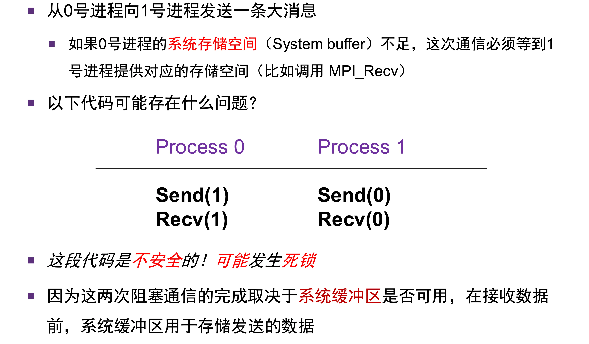
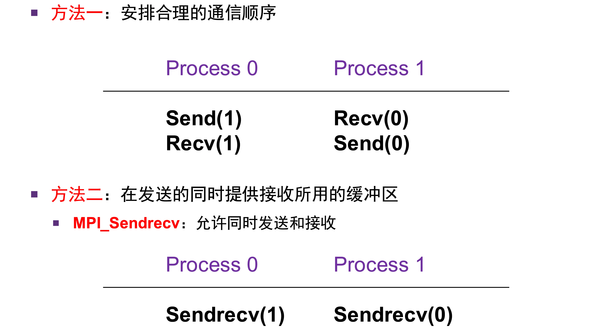
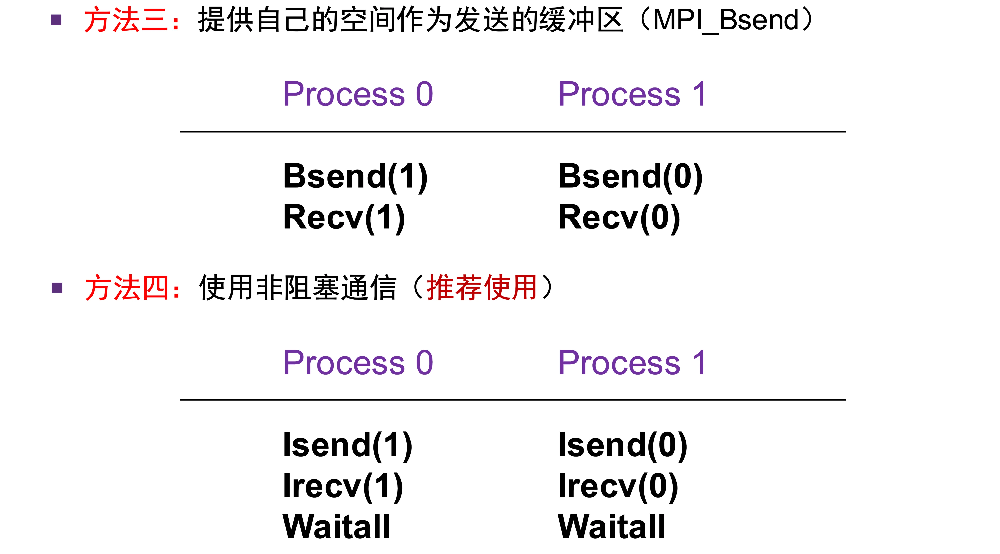

# 点对点通信

## 缓冲区

- 关于缓冲区的详细说明，可另见「MPI 与缓冲区」相关笔记。
- `MPI_Send` 只有在：系统缓冲区再次可以使用的时候，才能返回
	- 因此，它返回了不代表数据已经送达，只代表数据拷贝过程已经完成
	- 大数据的时候，需要通过握手协议，等待接收的空间够大，**send 会被阻塞，不返回**
- `MPI_Recv` 只有在消息被完整接收后才返回
	- 意味着：接收消息的系统缓冲区可用了
- 非阻塞通信：
	- 立即返回，通过句柄（request）来检查状态
	- 这里区分两个东西：
	- `MPI_Wait()`：
		- 这是阻塞操作，不利于计算和通信并行
	- `MPI_Test()`：
		- 这是单纯的测试而不等待
		- 可以使用这个，在测试失败的时候，继续进行其他计算
	- 非阻塞通信的 request，对于发送和接收的意义不同：
		- 发送的 request 正常后，说明发送过程结束，并不代表已经收到了信息

## 点对点通信协议

- Eager 协议：
	- 假定接收进程可以存储传入的数据（**空间足够**）
	- 延迟低，一般用于传输小消息，需要大量缓冲区
- Rendezvous 协议（握手协议）：
	- 需要和接收进程确认
	- 只有接收进程空间足够大的时候，才开始**发送数据**
	- 延迟高，不需要额外空间，传输大消息

## 通信死锁

- 经典的**相互等待**产生死锁
- 解决方法：

- 这就体现了**非阻塞通信的优势**：**推迟同步**
- 有一些同步显然是没有必要的：
	- 如有的时候，等待接收进程空间的时间，完全没有必要阻塞住
	- 因此，使用非阻塞通信，可以避免死锁的诞生

# 进程映射

- 为什么需要进程映射：
	- 不同进程的通信需求不一样
	- 不同节点的网络性能不一样（延迟，带宽）
- 进程映射：
	- 将进程和物理节点做合理映射，从而有效减小通信开销
	- 映射方式参考课程讲义《高性能计算导论》相关章节
- 进程绑定：
	- 将进程绑定在固定的 CPU Core / Socket 上
	- 避免进程在**内核间切换**导致的开销，减少 cache miss
	- 避免跨 NUMA 内存访问

# 集合通信算法的实现

- 具体实现参考课程讲义中对应部分；笔记中介绍经典的 Ring 算法，多个接口可以使用 Ring 类似实现

## Ring 算法

- 基本思想：每一个进程都从某个进程收取信息，然后给某个进程发送信息
- 好处：每个节点，每个轮次，都会与其他节点通信，充分利用网络带宽
- 一般用于：大数据的发送

# MPI 程序性能分析

- 通过 mpiP 库统计信息
	- 仅收集 MPI 函数的信息
	- 如运行环境信息，进程通信时间信息等
- `MPI_Wtime()`
	- 记录进程的运行时间
	- 用法类似 clock
- OSU 基准测试程序
