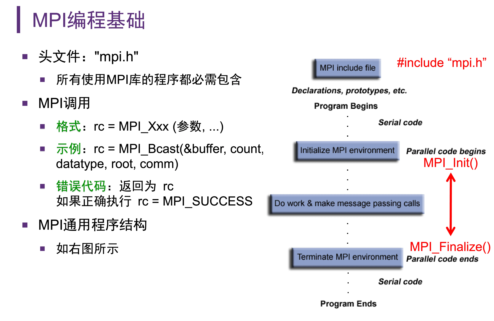
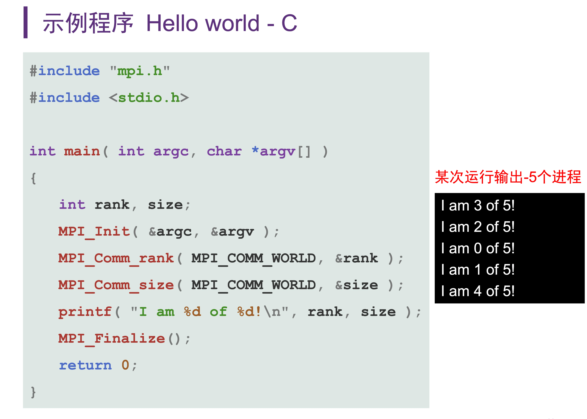
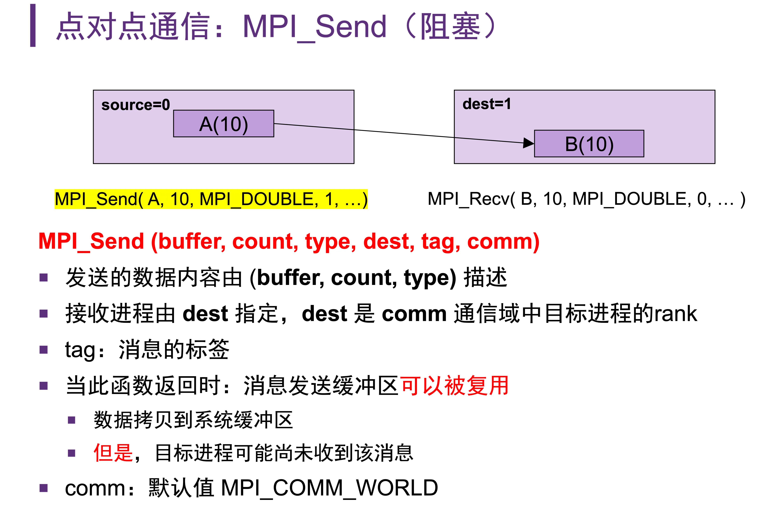
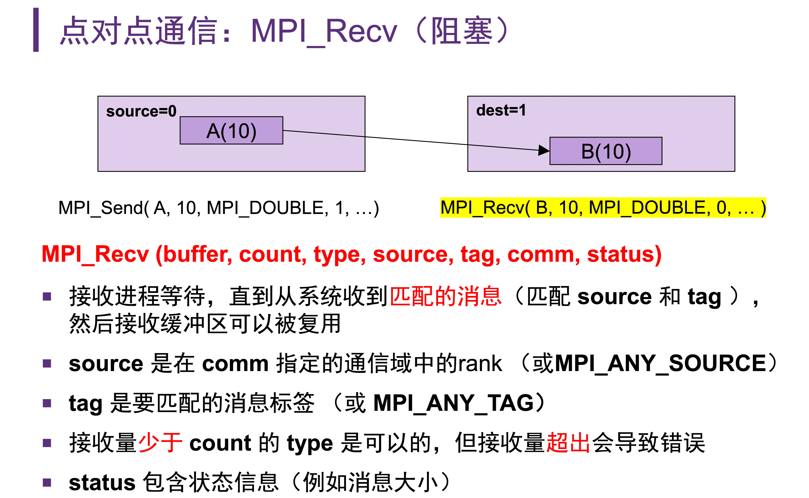
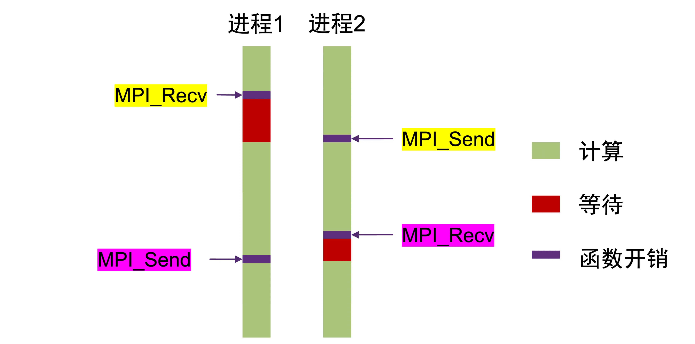
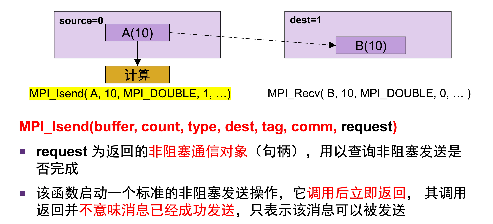
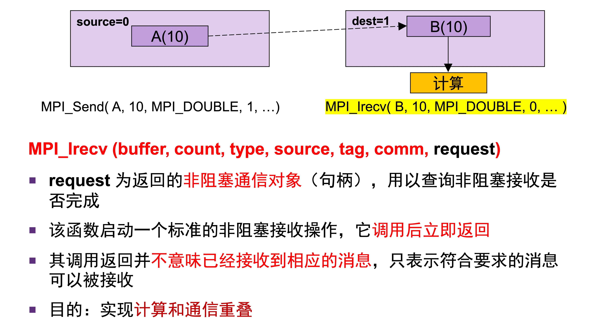
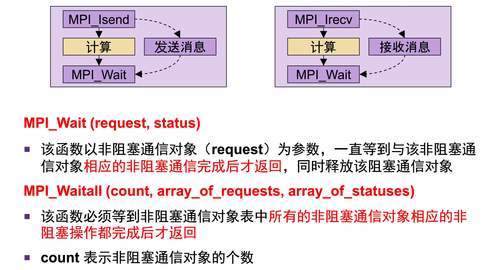
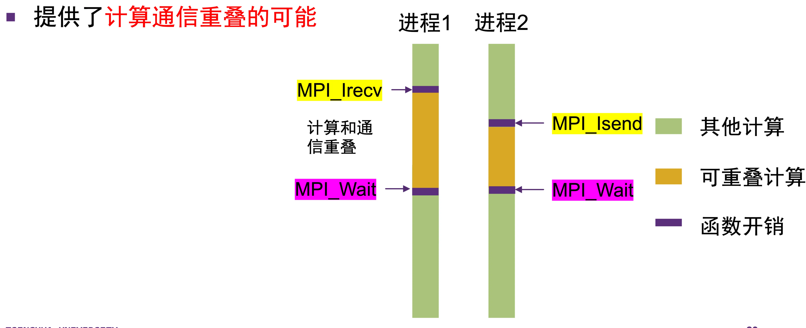
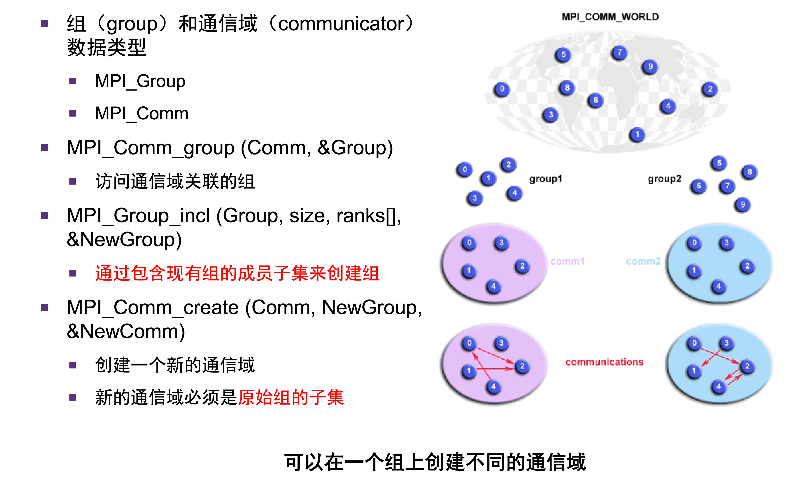

# MPI 基本情况

- 消息传递模型：
	- 指令流：不同指令流并发执行，指令的**同步**基于通信方式
	- 数据：不同指令有**独立地址空间**（如不同的进程），相互不可通过地址直接访问
	- 适用的硬件模型：分布式内存架构
- MPI 最终成为消息传递模型的标准：
	- 可移植性：在不同的机器或者平台上运行
	- 可扩展性：在数百个计算节点上运行
	- 灵活性：可以隔离 MPI 开发人员 和 MPI 程序员（服务端和用户端）

# 编写基本的 MPI 程序

## SPMD 编程风格

- 单程序多数据：
- 允许任务分支执行用户指定的**部分程序片段**
- 将数据**分发**给多个进程，实现并行

## MPI 编程基础

- 注意事项：
	- `MPI_Init()` 用于初始化 MPI 运行环境，是 MPI 代码的开始
	- `MPI_Finalize()` 用于结束 MPI 运行环境，是 MPI 代码的结束
	- 任何 MPI 函数接口的调用，返回值为状态码，而某些变量的赋值是通过传入地址实现的

## 经典的 MPI 接口函数

- `MPI_Comm_size(comm, &size)`：
	- `comm` 是一个 MPI 通信域，`size` 是传入的一个外部变量的地址
	- 这个函数会确定与通信域关联的组中的进程数量，赋值到 `size` 对应的地址处
- `MPI_Comm_rank()`：
	- 给出**当前进程**在通信域中的 Rank
	- 一般将 Rank 当作任务 ID

- 关于进程数的控制：
	- 可以使用 `mpirun -n 5 ./mpi_program`

# MPI 通信

## 点对点通信：（单进程对单进程）

### 阻塞式通信

- `MPI_Send(buffer, count, type, dest, tag, comm)`
	- `buffer` 是缓冲区的地址，指定发送位置
	- `count` 是发送的数据数量，`type` 是发送的数据类型
	- **tag** 是消息的**标签**，在接收数据的时候，需要识别这个标签
	- **dest** 是接收进程的 Rank（在通信域 **comm** 中）
- `MPI_Recv(buffer, count, type, source, tag, comm, status)`
	- `source` 是在 `comm` 中指定的 rank 的进程
	- `tag` 是匹配的消息标签，和 send 的标签需要一一对应
	- `status` 是状态信息
- 通配符：
	- `source`：`MPI_ANY_SOURCE`
	- `tag`：`MPI_ANY_TAG`
- 阻塞式通信：
	- 命令发出，需要**通信完成后**才返回
	- 如图：（从下往上看）
	- 接收信息的进程，要等到信息接收完成，才能做其他的事情

### 非阻塞式通信

- `MPI_Isend`、`MPI_Irecv`
	- 和普通的收发相比，多了一个 request，接收的少了一个 status
	- request 可以查询非阻塞通信是否完成
	- request 的使用，则需要用到 **MPI_Wait、MPI_Waitall**

- 目的：实现计算和通信的重叠
- 如下图所示：（从上往下看）：

### 其他

- 通信参数、数据类型、问题实例等细节见课程讲义《高性能计算导论》相关章节。

## 集合通信

- `MPI_Bcast(&buffer, count, datatype, root, comm)`
	- `root` 是广播的根进程的 Rank
	- 效果是：将根进程的 buffer，count 对应的数据，传给 comm 中其他进程
- `MPI_Reduce(&sendbuf, &recvbuf, count, datatype, op, dest, comm)`
	- 对 comm 中所有进程（包括汇总进程）执行规约操作，汇总在一个进程中
	- `op` 是预定义的规约操作，可以自定义
- `MPI_Scan(&sendbuf, &recvbuf, count, datatype, op, comm)`
	- 计算前缀规约（如前缀和）
- `MPI_Scatter(&sendbuf, sendcnt, sendtype, &recvbuf, recvcnt, recvtype, root, comm)`
	- 将不同的消息从 root 进程分发到所有进程
- `MPI_Gather(&sendbuf, sendcnt, sendtype, &recvbuf, recvcnt, recvtype, root, comm)`
	- 收集组中每个进程的不同消息到一个目标进程
- `MPI_Allgather(&sendbuf, sendcount, sendtype, &recvbuf, recvcount, recvtype, comm)`
	- 将数据串联到所有进程（所有进程的数据汇总，再分发给所有进程）
- `MPI_Allreduce(&sendbuf, &recvbuf, count, datatype, op, comm)`
	- 执行规约操作，并将结果存至所有进程
	- 相当于 Reduce 后再进行 Bcast
- `MPI_Alltoall(&sendbuf, sendcount, sendtype, &recvbuf, recvcount, recvtype, comm)`
	- 将组内所有进程的数据发送给其他所有进程
- `MPI_Barrier(comm)`
	- 在组内创建 barrier 同步
	- 阻塞所有进程，直到到达相同的 barrier 调用
	- 用于在并行程序中执行同步操作

# 通信域

- 组：定义了哪些进程可以相互通信
	- 组内部的进程可以相互通信
	- 不属于任何同一个组的两个进程无法相互通信
- 通信域：每一个组对应一个通信域
	- `MPI_COMM_WORLD`：所有进程所对应的总通信域
- 任务 ID：即 Rank
	- 初始化的时候由系统分配
	- 连续且从零开始
- 通信域和组的管理函数：

- 这里，组一般是通过传入的 `&Group` 参数进行赋值

# MPI-IO

- `MPI_File_open()`
	- 特点：
	- 不同进程文件，仅在底层打开一次
	- MPI 库共享并同步文件读写，使用**相同的文件句柄**
	- 可以同时进行读写操作
- 两种 IO 方式：
	- Independent IO：
		- 每个进程独立访问 IO
		- 没有明显的顺序
		- 适合大 IO 请求
	- Collective IO：
		- 读写共享内存缓冲区，最终只发出**一个文件请求**
		- 可以减小 IO 请求的数量，适合小 IO 请求
		- 不同进程之间需要同步

# MPI 程序的编译运行

- 运行命令：
	- 如：`mpirun -n 4 ./mpi_hello`
	- `-n` 指定运行的进程数量
