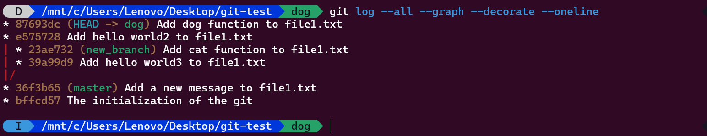
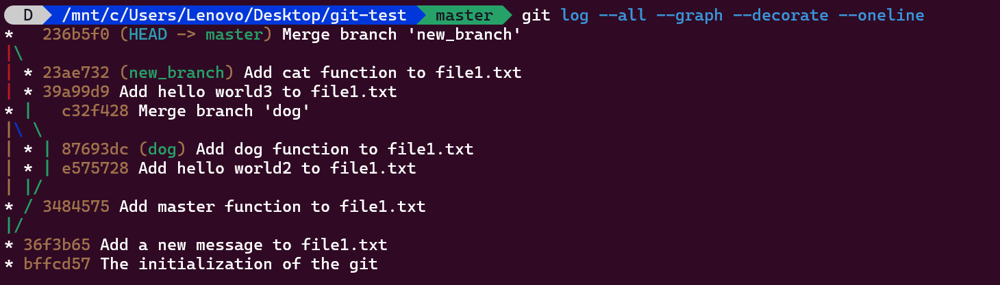
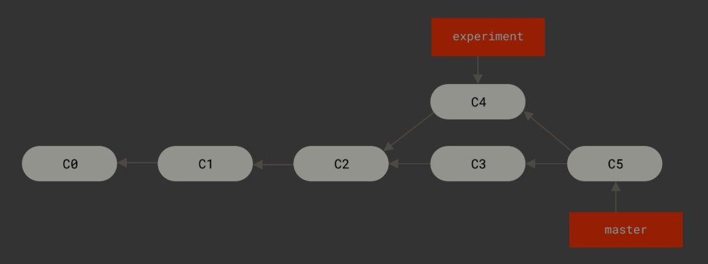
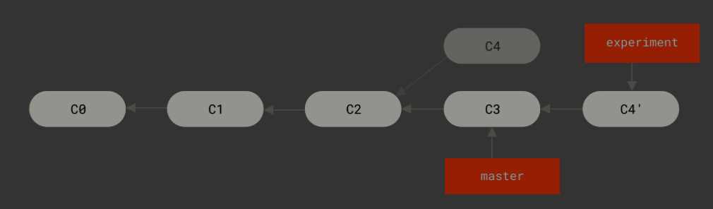

# git 的数据模型

## 基本的建模

- 文件夹<----->tree
- 文件   <----->blob
- git 追踪最顶层的文件夹

## 历史模型

- 基本概念：
	- 快照：一个时间戳上整个文件夹的状态（即一次commit）
	- 分支：从某一个快照分叉出的不同快照<br>
- 基本模型：有向无环图（而不是线性结构）
	- 图的节点：相当于一个快照，再加上元数据
		- 元数据：提交的作者，时间，描述等等
	- 图的边：相当于版本的迭代，由新版本指向旧版本
	- 可以从同一个快照连入不同的边
		- 如在某个已经可以运行的版本(now-ver.)
		- 连入第一条边：加入新的特性(new-ver.)
		- 连入第二条边：修复某个bug(fix-ver.)
	- 也可以从同一个快照连出不同的边
		- 如在最终版本(final-ver.)
		- 连出第一条边：加入新特性代码(new-ver.)
		- 连出第二条边：加入修复bug代码(fix-ver.)<br>

下图与 Obsidian 白板 `git-model.canvas` 含义一致：从同一快照分出两条线再合并（DAG，边由新提交指向父提交）。

```text
version1 ──▶ version2 ──new──▶ version-new ──merge──▶ version3
                │                                    ▲
                │fix-bug                             │
                ▼                                    │
           version-fix ─────────merge────────────────┘
```

## 数据模型

- commit可以用以下伪代码表示：
```c
type commit = struct{
	parents:array<commit*>   //此前提交记录
	author:string           //作者
	message:string          //信息
	snapshot:root_tree*      //根目录的完整状态
}
```

- 数据实际的存储
	- 每种数据都视作object（blob | tree | commit）
	- objects 代表存储 object 的字典
```c
object = blob | tree | commit
objects = map<string, object>
def store(o)
	id = hash(o)
	objects[id] = o
def load(id)
	return object[id]
```

- 由此实际上commit存储的parents,snapshot都
	- 类似指针or地址
	- 实际上是id，通过id在objects中寻址<br>
- 因此：每一次commit都对应着一个hash值（id）
- 但这样显示给用户的实际上是不可读的字符串，因此git还维护一个reference
```c
references = map<string, string>
```
- 将可读的名称映射到不可读的hash_id
- 注意一点：
	- 有向无环图的节点和边是无法更改的
	- 但reference是可以更改的，可以将一个name映射的id更改

# git命令

- 由前面的git模型，git的所有命令实际上都是
	- 对reference或者object的某种操作

## 初始化

- 建立一个git仓库：git init
	- git init会在当前目录内建立一个.git目录（当前仓库就是根目录，即snapshot记录的tree）
	- .git目录内存放所有git记录的信息
		- 内容为：objects refs info hooks description config HEAD
- git help 后接一个参数，会告诉你这个命令的作用

## 查看状态

- git status：查看当前状态
	- **一个重要的概念：暂存区**
	- 只有被添加进暂存区的文件，在commit的时候才会被记录进快照
	- 命令：git add 文件地址
	- 目的：
		- 有一些没有必要进行snapshot的文件（如日志，调试文件）可以不用commit
		- 开发了多个功能之后，想为每一个功能进行单独的commit
	- 这里注意：如果git add之后又一次对文件进行了修改，要重新git add
	- 否则commit会是没有修改之前git add的版本
- git add :/
	- 这会添加根目录下所有文件进暂存区
- 这里解释另一个概念：跟踪和未跟踪
	- 一个新的文件是未被跟踪的，相当于一次暂存区都没有进过
	- 要让其被跟踪，只需git add即可
	- 只要进过一次暂存区，这个文件就被永远跟踪了
	- 如果再修改了这个文件，会显示它已修改而不是未跟踪
	- **git 会自动监控已跟踪文件是否修改，而不会监控未跟踪文件**

## 删除和移动

- git rm：
	- 在工作目录中删除文件，同时不再跟踪这个文件
		- 如果这个文件被标记为已修改或已暂存，无法删除
	- 这时用git rm -f ：
		- 强制删除，即使已经修改或已经暂存<br>
- git rm --cached
	- 不在工作目录中删除文件，但不让git跟踪这个文件
	- 也可以用glob模式匹配<br>
- git mv file_from file_to
	- 即移动，或者重命名
	- 相当于以下三条命令：
		- mv file_from file_to
		- git rm file_from
		- git add file_to

## 提交

- git commit：提交
	- 会将当前暂存区的已修改文件，和整个root中未修改的文件进行snapshot
	- 会提示输入commit message
- git commit -a：
	- 这会将所有已经被git追踪的文件（已修改和未修改）进行snapshot
	- 但对于新的文件（未被追踪）不会commit
	- 要防止误提交不需要的文件<br>
- 提交信息的编写规范：
	- 用空行分隔主题和正文
	- 将主题行限制在 50 个字符
	- 主题行首字母大写
	- 主题行不以句号结尾
	- 主题行使用祈使语气
	- 正文换行至 72 个字符
	- 正文解释**是什么**和**为什么**，而不是**如何**

## 历史记录

- git log：可视化提交历史
	- 由于git log默认显示线性的提交记录（从当前版本追溯到源）
	- 一般会用下面的命令
- git log --all --graph --decorate
	- 这可以用图的形式，更加美观的展现提交**记录**
- git log --all --graph -- decorate --oneline
	- 这可以简化打印出的信息
- git log -p
	- 这会显示每次commit所引入的差异
	- 再加上 -n （n是数字），限制显示的日志条目数量
- git log --stat
	- 简略显示每次commit所引入的差异
- git --pretty
	- 另一个非常有用的选项是 `--pretty`。 这个选项可以使用不同于默认格式的方式展示提交历史。 这个选项有一些内建的子选项供你使用。 比如 `oneline` 会将每个提交放在一行显示，在浏览大量的提交时非常有用。 另外还有 `short`，`full` 和 `fuller` 选项，它们展示信息的格式基本一致，但是详尽程度不一：

```console
$ git log --pretty=oneline
ca82a6dff817ec66f44342007202690a93763949 changed the version number
085bb3bcb608e1e8451d4b2432f8ecbe6306e7e7 removed unnecessary test
a11bef06a3f659402fe7563abf99ad00de2209e6 first commit
```

- 最有意思的是 `format` ，可以定制记录的显示格式。 这样的输出对后期提取分析格外有用——因为你知道输出的格式不会随着 Git 的更新而发生改变：

```console
$ git log --pretty=format:"%h - %an, %ar : %s"
ca82a6d - Scott Chacon, 6 years ago : changed the version number
085bb3b - Scott Chacon, 6 years ago : removed unnecessary test
a11bef0 - Scott Chacon, 6 years ago : first commit
```

[`git log --pretty=format` 常用的选项](https://git-scm.com/book/zh/v2/ch00/pretty_format) 列出了 `format` 接受的常用格式占位符的写法及其代表的意义。

| 选项    | 说明                          |
| ----- | --------------------------- |
| `%H`  | 提交的完整哈希值                    |
| `%h`  | 提交的简写哈希值                    |
| `%T`  | 树的完整哈希值                     |
| `%t`  | 树的简写哈希值                     |
| `%P`  | 父提交的完整哈希值                   |
| `%p`  | 父提交的简写哈希值                   |
| `%an` | 作者名字                        |
| `%ae` | 作者的电子邮件地址                   |
| `%ad` | 作者修订日期（可以用 --date=选项 来定制格式） |
| `%ar` | 作者修订日期，按多久以前的方式显示           |
| `%cn` | 提交者的名字                      |
| `%ce` | 提交者的电子邮件地址                  |
| `%cd` | 提交日期                        |
| `%cr` | 提交日期（距今多长时间）                |
| `%s`  | 提交说明                        |
- 关于限定类型：
	- git log -n
		- 列出最近n条提交
	- git log --since=2.week  （等价于git log --after）
		- 列出最近两周的所有提交
	- git log --until=2.week   （等价于git log --before）
		- 列出两周前的所有提交
	- git log --author
		- 列出指定作者的提交
	- git log --grep
		- 搜索**提交说明**中的关键字
	- git log --no-merges
		- 隐藏合并提交
	- git log -S
		- 只会显示添加或删除了该字符串的提交
		- 如找出添加或删除了某一函数的提交：git log -S function_name
	- git log xxxxxxx -- path
		- 在最后加上路径名字，用来查找修改了path对应文件的commit
		- 这个很有用，也可以使用 -l 参数指定路径（git log -l path）
	- 在出现多个选项时，--all-match会匹配所有选项都匹配的，否则匹配任意一个选项匹配

## 标签：用于标记commit

- git tag
	- 输出已有的标签
	- git tag -l "pattern"可用特定的模式查找标签
	- git tag -l "v1.8.5*"匹配所有v1.8.5开头的标签
- git show tag_name
	- 查看标签信息以及与之对应的提交的信息
- 标签的分类：
	- 附注标签：较为全面的标签
		- 包含打标签者的名字，电子邮件，日期时间，标签信息等
		- 可以使用签名来验证
		- git tag -a tag_name -m "tag_information"
			- 为HEAD创建一个名为tag_name的附注标签，并指定tag_information
	- 轻量标签：相当于引用
		- git tag tag_name
			- 为HEAD创建一个名为tag_name的轻量标签
		- git show 时只会显示出提交信息
	- 后期打标签：指定commit打标签
		- git tag -a tag_name commit_sh
		- git tag tag_name commit_sh
- 共享标签：
	- git push \<remote\> tag_name
		- 将tag_name推送到远程仓库
	- git push \<remote\> --tags
		- 将所有不在远程仓库的tags都推送
- 删除标签：
	- git tag -d tag_name
		- 这会删除本地的标签
		- 但并不会删除远程仓库的标签
		- 需要使用 git push \<remote\> :refs/tags/tag_name 来更新远程仓库
		- 相当于把冒号前面的空字符更新为远程仓库中的tag_name
	- 更加直观的删除远程仓库标签方式：
		- git push \<remote\> --delete tag_name
- 检出标签：
	- git checkout tag_name
		- 这会查看当前标签所指向的文件版本
		- 但会处于分离头指针的状态(detached HEAD)
		- 这个状态下的提交不属于任何分支，且无法访问（除非指定commit_hash）
		- 因此如果需要更改，应该创建一个新的分支


## 关于HEAD，master和checkout

- HEAD是一个引用，指向上次的commit
	- **注意当前目录不是HEAD！与HEAD不同！**
	- 简单来说：当前目录是你正在修改的
	- 而HEAD指向最近的commit（已完成版本）<br>
- master是一个引用，指向主分支的最后一个commit<br>
- git checkout（hashid）
	- 将工作目录恢复到hashid的commit的状态
	- 这会将HEAD指向这个hashid的commit
- git checkout file_adress 
	- 这会丢弃指定文件的修改，将其内容变回HEAD版本<br>
## 详细解释git diff

- git diff 
	- 显示  **当前工作区文件**  与  **暂存区文件**  发生了什么变化
	- 即理解为：修改后未暂存的变化
	- 注意：**未修改的文件相当于是属于暂存区**的，即可能实际上是和**上一次commit**比较
- git diff --staged  （相同的命令：git diff --cached）
	- 显示  **暂存区文件**  与  **上一次commit文件**  发生了什么变化
	- 理解为：即将commit的版本与上一个版本发生的变化
- git diff file_adress
	- 显示指定文件自上次快照（HEAD）以来发生了什么变化
	- 注意：这里指的是当前工作区中文件的内容和暂存区的内容，发生了什么变化
		- 如果已经放进了暂存区，则不会显示变化
- git diff hashid file_adress
	- 显示指定文件自指定commit以来发生了什么变化
- git diff hashid1 hashid2 file_adress
	- 显示指定文件从hashid1 至 hashid2 发生了什么变化

## 分支和合并

- git branch 
	- 列出本地仓库中存在的所有分支
	- 添加 -vv 以打印更加详细的信息
	- git branch --merged
		- 查看哪些分支已经合并到当前分支
	- git branch --no-merged
		- 查看哪些分支未合并到当前分支
		- 对于未合并的分支，在删除时会失败
- git branch name
	- 创建一条新的branch，同时以name为名创建一个新的引用
	- 这个引用指向HEAD同一个分支（即上一个commit）
- git checkout name
	- 将工作目录替换为name引用指向的commit，并切换分支
	- 即HEAD记录的分支不再是master，而是name
	- 现在再进行一个commit
		- name 将会指向 分支的最新一次提交
		- HEAD 依旧指向上一次提交，且指向的分支为name
		- master不变
	- 简化的命令：
		- git checkout -b new_name
		- 创建一个新的branch并且切换进入其中<br>
- 一个多分支的图例：


- git merge
	- 将某一条分支合并到当前分支：
	- **这里一定要注意一点！！！**
		- 如果：当前commit是需要合并的分支的某个**直接祖先**
		- 会直接将当前分支的引用指向带合并分支的引用
		- 可以理解为：
		- 本来就是一条分支而已，只不过把落后的引用（master）指向最新的引用（name）
	- 但如果当前commit**不是直接祖先**的话：
		- 则会新建一个commit用来融合，融合节点的父节点分别为两个
		- 融合完成后当前分支的引用指向最新的分支<br>
	- 发生融合冲突时：
		- 会提示让开发者修复冲突的文件
		- 修复完成后，**先将文件git add一遍**，再输入git merge --continue
		- 则会继续merge的过程
		- 这个时候如果可以成功融合，会让你输入这次提交的信息<br>
- merge 之后的图例：（注意到新建了两个commit用来存merge dog 和 new_branch）

- git branch -d branch_name
	- 删除指定分支
	- 当分支所实现的功能已经加入了master（merge），就可以不需要这个分支了
	- 这时就可以删除这条分支
## 变基

- git rebase branch_name
	- 相当于先找到当前分支和branch_name分支的最近公共祖先g
	- 将当前分支的每一次commit相对于g作的改动暂存起来
	- 应用在banch_name中
	- 这里可以顾名思义：
		- 变基：相当于将把**以祖先为基础**的改动
		- 变动到以branch_name的最新commit为基础上
	- 这可以让开发过程即使是并行的，但看上去是线性的<br>
- 这是普通merge的效果：


- 这是变基的效果：


- 这两者中`c4'`和`c5`的内容是完全一样的
	- 除了`c5`中commit信息是合并，而`c4'`的commit信息与`c4`一模一样
- 使用变基的风险：
	- 如果你将某次修改已经提交给了远程，那么别人可能就会基于你的修改新建分支
	- 但这时如果你又改为了变基，这样就丢弃了某次commit
	- 这时以你的那次commit为base工作的人push 和 pull 都会出现问题
- 因此：
	- 只在本地使用变基，对于已经推送到远程的不用变基
	- 这才便于开发协作
# 远程协作

## 远程仓库

- git remote
	- 列出当前仓库所知道的所有远程仓库
	- 加上 -v 显示需要读写远程仓库使用的 Git 保存的简写与其对应的 URL
- git remote add name url
	- 添加一个远程仓库，从url，命名为name
	- 一般name约定俗成为origin（如果只有一个远程仓库）
- git clone url path
	- 从克隆一个仓库到本地，创建本地副本
	- 从url克隆到本地的path
- git remote show \<remote\>
	- 列出远程仓库URL以及跟踪分析的信息，比如正处于的分支，提交和拉取所对应的远程分支
- git remote rename origin_name new_name
	- 将origin_name 对应的分支重命名为 new_name
- git remote remove \<remote\>
	- 移除这个远程仓库，同时会删除相应信息，比如远程跟踪分支及其配置信息
## 拉取与推送

- git push name local_branch:remote_branch
	- 效果：在name这个远程仓库中
	- 如果有remote_branch这个分支，直接将其改为本地分支的内容
	- 如果没有，则新建并将其改为本地分支的内容
- git push之后，再用git log，可以看见：
	- 除了本地的reference以外，还可以看见所关联的远程分支指向的commit
- git branch --set-upstream-to=name/remote_branch
	- 这可以将当前分支的默认push指向name仓库的remote_branch分支
	- 然后就可以直接用git push 简化命令了
	- 这时使用git branch -vv ，可以看见分支关联的远程仓库分支<br>
- git fetch url
	- 指定一个远程仓库，并获取其最近的状态更新信息
	- 如果本地已经关联了一个远程仓库，直接git fetch 即可
	- 注意这只是将数据下载到本地，并不会自动合并或修改当前工作
- git fetch 之后，可以直接使用git merge 同步内容
- 更简单的版本：git pull
	- 相当于git fetch ; git merge
	- 获取最新的远程仓库状态，并同步到本地

# 撤销操作

- git commit --amend
	- 效果：将暂存区的文件提交并附上提交信息，这会覆盖上一次的提交！！！
	- 用处：提交后发现忘了暂存一些修改，或想重新编辑提交信息
- git reset HEAD file
	- 效果：将已修改且已暂存的文件，恢复到：已修改未暂存的状态
	- 用处：想分作两次提交，却意外同时暂存了
- git checkout -- file
	- 效果：将已修改文件的修改内容删除，恢复到：未修改状态（即上一次commit的状态）
	- 用处：比如增加了一些打印语句用于调试，debug完之后恢复原来的状态
	- 慎用！！！：这会删除工作区对这个文件所有的修改！！！
# .gitignore

文件 `.gitignore` 的格式规范如下：

- 所有空行或者以 `#` 开头的行都会被 Git 忽略。
    
- 可以使用标准的 glob 模式匹配，它会递归地应用在整个工作区中。
    
- 匹配模式可以以（`/`）开头防止递归。
    
- 匹配模式可以以（`/`）结尾指定目录。
    
- 要忽略指定模式以外的文件或目录，可以在模式前加上叹号（`!`）取反。
    

所谓的 glob 模式是指 shell 所使用的简化了的正则表达式。 星号（`*`）匹配零个或多个任意字符；`[abc]` 匹配任何一个列在方括号中的字符 （这个例子要么匹配一个 a，要么匹配一个 b，要么匹配一个 c）； 问号（`?`）只匹配一个任意字符；如果在方括号中使用短划线分隔两个字符， 表示所有在这两个字符范围内的都可以匹配（比如 `[0-9]` 表示匹配所有 0 到 9 的数字）。 使用两个星号（`**`）表示匹配任意中间目录，比如 `a/**/z` 可以匹配 `a/z` 、 `a/b/z` 或 `a/b/c/z` 等。

我们再看一个 `.gitignore` 文件的例子：

```
# 忽略所有的 .a 文件
*.a

# 但跟踪所有的 lib.a，即便你在前面忽略了 .a 文件
!lib.a

# 只忽略当前目录下的 TODO 文件，而不忽略 subdir/TODO
/TODO

# 忽略任何目录下名为 build 的文件夹
build/

# 忽略 doc/notes.txt，但不忽略 doc/server/arch.txt
doc/*.txt

# 忽略 doc/ 目录及其所有子目录下的 .pdf 文件
doc/**/*.pdf
```

|     |                                                                                                                                    |
| --- | ---------------------------------------------------------------------------------------------------------------------------------- |
| Tip | GitHub 有一个十分详细的针对数十种项目及语言的 `.gitignore` 文件列表， 你可以在 [https://github.com/github/gitignore](https://github.com/github/gitignore) 找到它。 |
- 除了仓库的根目录下，子目录中也可能有.gitignore文件

# 杂项：

## 配置文件

- 可以直接通过git config命令配置一些东西
- 也可以通过~/.gitconfig
## 克隆超大仓库

- git clone --shallow
	- 不会将整个仓库克隆下来，而是只克隆最近的快照
## 交互式git add

- 应用在这种场景：
	- 如果你在修复bug的时候增加了一些输出调试语句
	- 当然可以先删除，再git add
- 但采用git add -p file更加便利：
	- 会弹出一个交互式页面，显示所有的更改
	- 可以依次选择那些更改要提交（实际修复bug的代码）
	- 哪些更改不需要提交（输出调试语句）
- git diff --cashed
	- 显示暂存区中文件的变化（与git add -p配合使用）
- 然后可以直接commit，这样就会提交实际需要的更改
- 再使用git chechout file，就会丢弃调试语句
	- 因为现在HEAD指向的commit中，修复语句已经保存了
	- 而debug语句仍然处于未保存状态，直接返回HEAD版本即可

## 找到具体修改

- git blame + 文件路径
	- 显示这个文件中，每一行都是谁修改的
		- 配合管道和grep使用有奇效
	- 找出谁在哪一次commit修改了这行代码
	- 显示相关的提交信息

## 可以回退的更改

- git stash 
	- 将仓库恢复到上一次commit版本
	- 但目前的更改并不会丢失，而是被保存在某个地方
	- git stash pop 将重新回退工作区