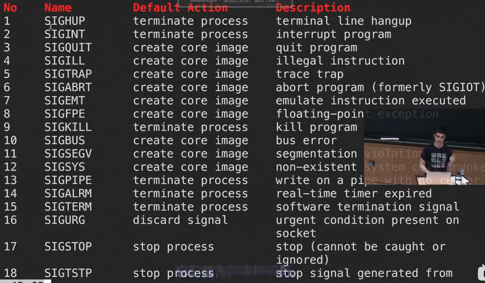
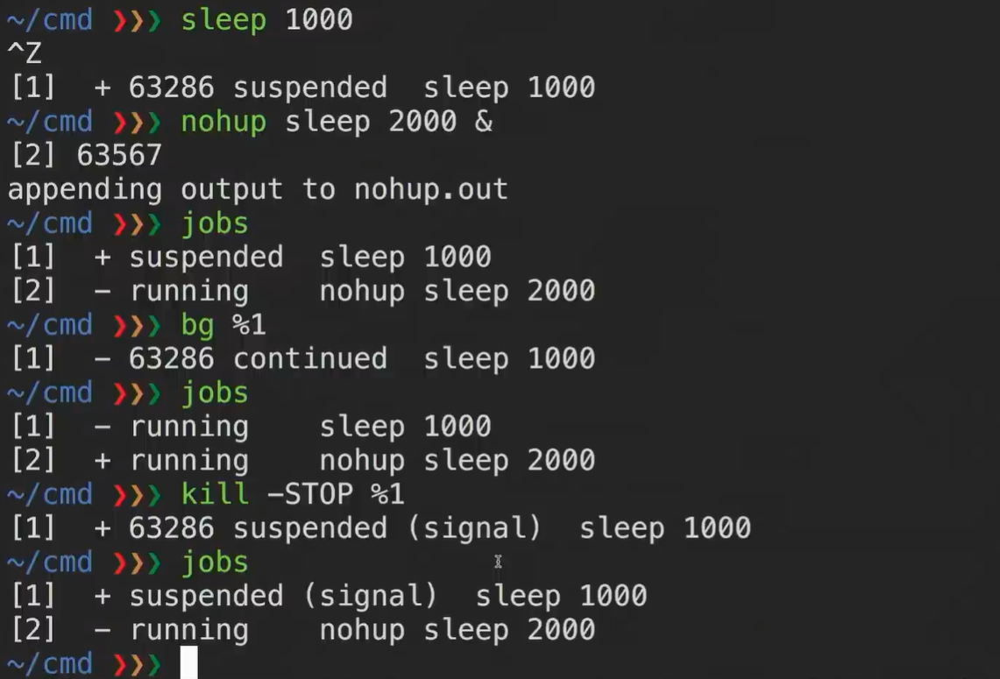

# job control

## 基本知识

- 终端通过向程序发送signal来控制进程
- 使用man signal命令看到所有的signal
	- 常用的比如：ctrl+C，发送SIGINT，代表终止进程
	- SIGQUIT也是终端上退出程序的信号，用ctrl+/ 发送
	- SIGSTOP暂停一个程序，用ctrl+Z发送
	- SIGCONT继续一个程序
- 

## 一个控制进程的例子：

- 其中ctrl+z会暂停一个进程，并打印其进程号（63286）和当前进程号（1）<br>
- nohup sleep 2000 & 代表让sleep 2000这个程序在后台运行
	- 带有 & 后缀的命令会直接在后台运行
	- 同时会显示进程号（63267）和当前进程号（2）
	- nohup 前缀代表忽略SIGHUP
- jobs显示当前程序及其状态，suspended暂停，running正在运行
- 使用ctrl + z让一个程序暂停，然后输入
	- bg代表让一个程序在后台继续运行，%i 中 i 代表当前进程号
	- fg代表将一个程序在前台继续运行，并重新连接到标准输出
- kill 实际上是一个控制指令，后面可以跟上参数来控制对进程的操作
	- -STOP相当于暂停这个程序
	- -HUP相当于挂起这个程序，但对于nohup ··· &标识的，不起作用
	- -KILL相当于无视任何条件终止程序运行

# 终端复用器(tmux)

## 基本用法

- 终端中键入tmux，启动新的会话，相当于进入另一个shell
	- 创建新会话的另一种方式：tmux new -t newname
	- 相当于创建一个名为newname的会话
- 按下ctrl + b， 松开两个按键，再按下d，相当于脱离这个会话，回到原来的shell
	- 注意这个时候原先的会话仍然存在且在运行
- 按下ctrl + d，相当于结束这个会话
- 原来shell中输入tmux a，相当于重新进入刚刚的会话
	- tmux ls会列出所有的会话列表
	- tmux a -t i 可以指定附着到会话i，（i代表会话的名字）
- 注意：以下命令不能在最原始的shell中运行，只能在tmux打开的会话中运行<br>
- 在一个会话内部：
	- ctrl + b，松开再按c（create），相当于会话内新开一个窗口
	- ctrl + b，松开再按p（previous），跳转到之前的窗口
	- ctrl + b，松开再按n（next），跳转到下一个窗口
	- ctrl + b，松开再按数字，跳转到指定窗口
	- ctrl + b，送考再按逗号（，），重命名当前窗口
- 在一个窗口内部：
	- ctrl + b，松开再按双引号（“），相当于竖直切分出一个新的shell（面板）
	- ctrl + b，松开再按%，相当于水平切分出一个新shell（面板）
	- ctrl + b，松开再按箭头，即可将光标在不同面板中移动
	- ctrl + b，松开再按空格，重新排布当前面板（一直按就会一直有风格变化）
	- ctrl + d，即关闭当前窗口，如果已经是最后一个窗口了就会关闭会话
- 在光标选中了一个面板时：
	- ctrl + b，松开再按z，扩张这个面板至全屏
	- 再次按下相同按键即返回原先多面板布局
# 别名：alias

## 基本用法
- 别名的作用：给长命令起一个别名以便快捷的输入
- 例子：alias ll=”ls -alh“  （注意，等号前后不能有空格）
- 这样在终端输入ll的时候，命令会自动替换为ls -alh
	- 一些神秘的例子：
	- alias gs="git status"
	- alias sl=ls，即将容易输错的命令给一个别名
	- 默认提供参数：如alias mv="mv -i"（mv -i代表在覆盖文件内容前给出提示）
- alias 已存在别名：代表查询这个别名代表什么
## 持久化别名
- 只需在配置文件里面输入设置别名的命令，即可持久化至终端
- 如在~/.bashrc里面：
	- alias ll="ls -alh"
	- alias cd..="cd .."
	- alias mv="mv -i"
- 这两个别名就被永久加载至bash里了

# 配置文件（dotfile）
## 基本想法

- 配置文件实际上就是在程序启动时预加载的一系列指令，也包括可能的设置。
- 设置这些配置文件可以快捷的完成一些初始的设置，避免重复工作

## 配置文件的管理和复用

- 配置文件总是不断变化的，属于一个应该长期管理的项目
- 配置文件应该在不同的主机上可以快速的复用，具备可移植性
- 因此：
- 我们应该如何管理这些配置文件呢，它们应该在它们的文件夹下，并使用版本控制系统进行管理，然后通过脚本将其  [符号链接](shell.md#符号链接)  到需要的地方。这么做有如下好处：
- **安装简单**: 如果您登录了一台新的设备，在这台设备上应用您的配置只需要几分钟的时间；
- **可移植性**: 您的工具在任何地方都以相同的配置工作
- **同步**: 在一处更新配置文件，可以同步到其他所有地方
- **变更追踪**: 您可能要在整个程序员生涯中持续维护这些配置文件，而对于长期项目而言，版本历史是非常重要的
## 经典的dotfile及其配置（会不断补充）
### .bashrc
- alias 别名
### .vimrc
- 
### [.gdbinit](gdb-brief.md)
- b xxx：设置断点
	- 再加上command ··· end包裹起来的命令，可以实现断点编程
	- 到达断点的时候自动执行指令
		- 比如j：跳转至某一行
- set args xxx：设置程序默认参数
- r：运行
- layout regs：设置程序启动时的默认参数（如由文件读入）

# 符号链接
符号链接（Symbolic Link），也称为**软链接**（soft link），是类 Unix 系统（如 Linux、macOS）中的一种特殊文件类型，用于指向另一个文件或目录。它类似于 Windows 中的快捷方式，但功能更灵活。以下是对符号链接的详细解释，包括定义、原理、用法、与硬链接的区别、以及在你的上下文（SSH 配置等）中的可能应用。

---

## 1. **什么是符号链接？**

- **定义**：符号链接是一个文件，包含另一个文件或目录的路径，指向目标的逻辑引用。访问符号链接时，系统会重定向到目标文件或目录。
- **特点**：
    - 符号链接是一个独立的文件，存储目标的路径（类似指针）。
    - 它可以指向文件、目录，甚至不存在的目标。
    - 符号链接可以跨文件系统（例如，指向不同磁盘或分区）。
- **文件系统表示**：
    - 在 Linux 中，符号链接显示为文件类型 l（通过 ls -l 查看）。
    - 示例：
        
      
        
        ```
        ls -l
        lrwxrwxrwx 1 user user 10 Oct 26 16:00 mylink -> target.txt
        ```
        
        - lrwxrwxrwx：l 表示符号链接。
        - mylink：链接文件名。
        - -> target.txt：指向的目标文件。

---

## 2. **符号链接的原理**

- **存储内容**：符号链接文件只保存目标文件或目录的**路径**（绝对或相对路径），而不是实际数据。
- **访问机制**：
    - 当访问符号链接时，操作系统读取链接中的路径，重定向到目标文件或目录。
    - 如果目标不存在，访问链接会失败（称为“悬空链接”）。
- **独立性**：
    - 符号链接与目标文件是独立的，删除符号链接不会影响目标，删除目标会导致链接失效。
    - 修改目标文件会反映在所有指向它的符号链接上。

---

## 3. **创建符号链接**

使用 ln 命令创建符号链接，带 -s 参数表示软链接（symbolic link）。

### **语法**

bash

```
ln -s <目标路径> <链接名称>
```

- -s：指定创建符号链接（不加 -s 创建硬链接）。
- <目标路径>：要指向的文件或目录。
- <链接名称>：符号链接的名称。

### **示例**

1. **创建指向文件的符号链接**：
    
    ```
    ln -s /home/user/doc.txt link_to_doc
    ```
    
    - 创建符号链接 link_to_doc，指向 /home/user/doc.txt。
    - 访问 link_to_doc 等同于访问 doc.txt。

1. **创建指向目录的符号链接**：
    
    ```
    ln -s /home/user/docs my_docs
    ```
    
    - 创建符号链接 my_docs，指向 /home/user/docs 目录。
    - 进入 my_docs 等同于进入 docs。
2. **验证**：
    
    ```
    ls -l
    lrwxrwxrwx 1 user user 15 Oct 26 16:00 link_to_doc -> /home/user/doc.txt
    lrwxrwxrwx 1 user user 14 Oct 26 16:00 my_docs -> /home/user/docs
    ```
    

### **注意**

- **绝对路径 vs 相对路径**：
    - 推荐使用绝对路径（如 /home/user/doc.txt），避免链接因目录移动失效。
    - 相对路径（如 ../doc.txt）适合目标和链接在同一目录结构中。
- **覆盖链接**：
    - 如果链接名已存在，需加 -f 强制覆盖：
        
        ```
        ln -sf /new/target link_to_doc
        ```
        
- **悬空链接**：
    - 如果目标不存在，链接会失效：
        
        ```
        ln -s nonexistent.txt bad_link
        ls -l bad_link
        lrwxrwxrwx 1 user user 12 Oct 26 16:00 bad_link -> nonexistent.txt
        ```
        

---

## 4. **符号链接 vs 硬链接**

符号链接和硬链接（hard link）都是文件系统的链接方式，但有关键区别：

| **特性**    | **符号链接（软链接）**           | **硬链接**                  |
| --------- | ----------------------- | ------------------------ |
| **定义**    | 指向目标路径的独立文件，类似快捷方式。     | 指向同一 inode 的文件，直接引用目标数据。 |
| **文件类型**  | 独立文件，类型为 l（符号链接）。       | 与目标文件共享 inode，类型与目标相同。   |
| **指向目标**  | 保存目标路径，可指向文件、目录或不存在的目标。 | 只能指向文件，不能指向目录或不存在的目标。    |
| **跨文件系统** | 支持（可指向不同分区或磁盘）。         | 不支持（必须在同一文件系统）。          |
| **目标删除**  | 链接失效（悬空链接）。             | 硬链接仍有效（直到所有硬链接删除）。       |
| **创建命令**  | ln -s <目标> <链接>         | ln <目标> <链接>             |
| **示例**    | ln -s file.txt link     | ln file.txt link         |

**示例**：

```
touch original.txt
ln -s original.txt soft_link  # 符号链接
ln original.txt hard_link     # 硬链接
ls -l
-rw-rw-r-- 2 user user 0 Oct 26 16:00 hard_link
-rw-rw-r-- 2 user user 0 Oct 26 16:00 original.txt
lrwxrwxrwx 1 user user 12 Oct 26 16:00 soft_link -> original.txt
```

- 删除 original.txt 后：
    - soft_link 失效（悬空链接）。
    - hard_link 仍包含数据（因为共享 inode）。

---

## 5. **符号链接的常见用途**

- **简化路径**：
    - 将长路径映射为短路径：
        
        ```
        ln -s /var/www/html website
        cd website  # 等同于 cd /var/www/html
        ```
        
- **版本管理**：
    - 指向最新版本的软件或库：
        
        ```
        ln -s /opt/python3.9 python
        ```
        
- **配置文件管理**：
    - 指向共享配置文件：
        
        ```
        ln -s /shared/config/.bashrc ~/.bashrc
        ```
        
- **跨目录访问**：
    - 让文件或目录在多个位置可用：
        
        ```
        ln -s /data/docs ~/docs
        ```