

# 概率统计第八讲：函数分布——向量函数的分布与特征数

## 1 本讲提要

**向量函数的分布：**

- 向量双射密度公式
- 和、积与商的分布
- 抽样分布（$F$ 分布、$t$ 分布）

**特征数：**

- 函数的数学期望
- 协方差与相关系数
- 相关性质

---

## 2 光滑双射密度公式

!!! abstract "定理（光滑双射密度公式）"

    若随机变量 $(X, Y)$ 的联合密度函数为 $p(x, y)$，则光滑双射 $(U, V) = G(X, Y)$ 给出的随机变量 $(U, V)$ 的联合密度为：

    $$
    p_{U,V}(u, v) = p(x(u,v),\; y(u,v))\,|J(u,v)|, \quad (u,v) \in R(G),
    $$

    其中 **Jacobi 行列式** 为：

    $$
    J(u,v) = \begin{vmatrix} \dfrac{\partial x}{\partial u} & \dfrac{\partial x}{\partial v} \\[6pt] \dfrac{\partial y}{\partial u} & \dfrac{\partial y}{\partial v} \end{vmatrix} = \frac{\partial x}{\partial u}\frac{\partial y}{\partial v} - \frac{\partial x}{\partial v}\frac{\partial y}{\partial u}.
    $$

推导思路：对 $(U, V) \in A$，有

$$
P[(U,V) \in A] = P[(X,Y) \in G^{-1}A] = \iint_{G^{-1}A} p(x,y)\,\mathrm{d}x\mathrm{d}y = \iint_A p(x(u,v),\;y(u,v))\,|J(u,v)|\,\mathrm{d}u\mathrm{d}v.
$$

---

## 3 线性映射的分布

!!! abstract "推论（线性映射）"

    设 $\det A \neq 0$ 且 $Y = AX + b$，则：

    $$
    p_Y = p_X(A^{-1}Y - A^{-1}b) / |\det A|.
    $$

!!! tip "正态分布在线性变换下的不变性"

    若 $(X, Y) \sim N(\mu_1, \mu_2, \sigma_1^2, \sigma_2^2, \rho)$，令 $X^* = \dfrac{X - \mu_1}{\sigma_1}$，$Y^* = \dfrac{Y - \mu_2}{\sigma_2}$，则 $(X^*, Y^*) \sim N(0, 0, 1, 1, \rho)$。

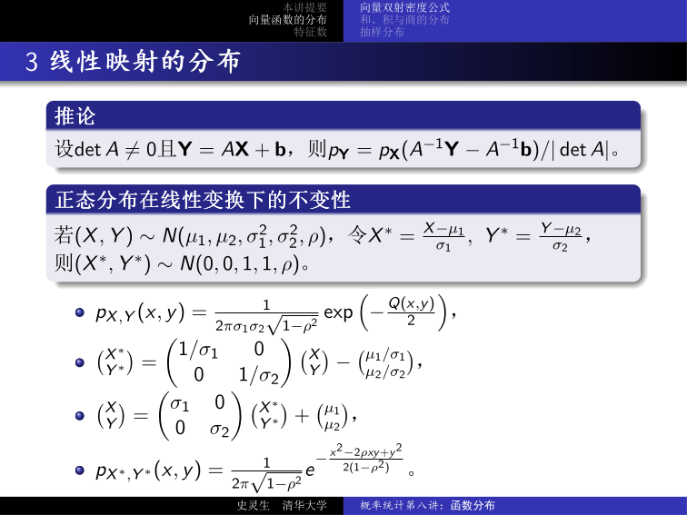

---

## 4 和的分布

!!! abstract "定理（和的分布）"

    若 $(X, Y)$ 的联合密度函数为 $p(x, y)$，则 $U = X + Y$ 的密度函数为：

    $$
    p_U(u) = \int_{-\infty}^{\infty} p(u - v,\; v)\,\mathrm{d}v.
    $$

??? note "证明"

    令 $V = Y$，则 $\binom{U}{V} = \binom{1\;1}{0\;1}\binom{X}{Y}$，

    $\binom{X}{Y} = \binom{1\;-1}{0\;\;1}\binom{U}{V}$，

    $p_{U,V}(u, v) = p(u - v, v) \left|\det\binom{1\;1}{0\;1}\right|^{-1} = p(u-v, v)$，

    $p_U(u) = \int_{-\infty}^{\infty} p_{U,V}(u, v)\,\mathrm{d}v = \int_{-\infty}^{\infty} p(u - v, v)\,\mathrm{d}v$. $\square$

---

## 5 积的分布

???+ example "例：积的分布"

    $(X, Y)$ 的联合密度函数为 $p(x, y)$，则 $U = XY$ 的密度函数为：

    $$
    p_U(u) = \int_{-\infty}^{\infty} p(u/v,\; v) / |v|\,\mathrm{d}v.
    $$

令 $V = Y$，则 $\binom{U}{V} = \binom{XY}{Y}$，$\binom{X}{Y} = \binom{U/V}{V}$，

$$
J = \begin{vmatrix} 1/v & -u/v^2 \\ 0 & 1 \end{vmatrix} = 1/v.
$$

!!! abstract "推论"

    若 $X, Y$ 相互独立，则 $U = XY$ 的密度函数为：

    $$
    p_U(u) = \int_{-\infty}^{\infty} p_X(u/v)\,p_Y(v) / |v|\,\mathrm{d}v.
    $$

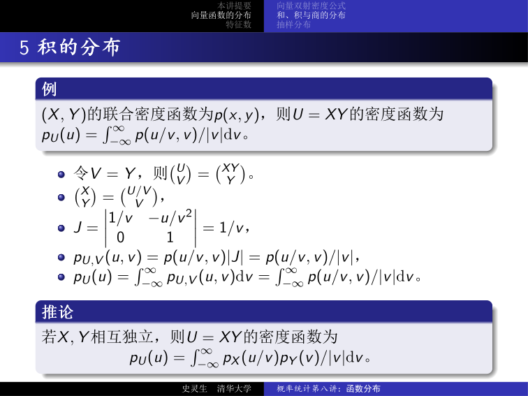

---

## 6 商的分布

???+ example "例：商的分布"

    $(X, Y)$ 的联合密度函数为 $p(x, y)$，则 $U = X/Y$ 的密度函数为：

    $$
    p_U(u) = \int_{-\infty}^{\infty} p(uv,\; v)\,|v|\,\mathrm{d}v.
    $$

令 $V = Y$，则 $\binom{X}{Y} = \binom{UV}{V}$，$J = \begin{vmatrix} v & u \\ 0 & 1 \end{vmatrix} = v$。

!!! abstract "推论"

    若 $X, Y$ 相互独立，则 $U = X/Y$ 的密度函数为：

    $$
    p_U(u) = \int_{-\infty}^{\infty} p_X(uv)\,p_Y(v)\,|v|\,\mathrm{d}v.
    $$

---

## 7 $F$ 分布

!!! abstract "定义（$F$ 分布）"

    设 $X \sim \chi^2(m)$，$Y \sim \chi^2(n)$ 相互独立，则称 $F = \dfrac{X/m}{Y/n}$ 的分布是自由度为 $m$ 与 $n$ 的 **$F$ 分布**，记为 $F \sim F(m, n)$，其中 $m$ 为分子自由度，$n$ 为分母自由度。

$F$ 分布的密度函数为：

$$
p_F(x) = \frac{\Gamma\!\left(\frac{m+n}{2}\right)}{\Gamma\!\left(\frac{m}{2}\right)\Gamma\!\left(\frac{n}{2}\right)} \left(\frac{m}{n}\right)^{m/2} x^{m/2-1} \left(1 + \frac{m}{n}x\right)^{-(m+n)/2}, \quad x > 0.
$$

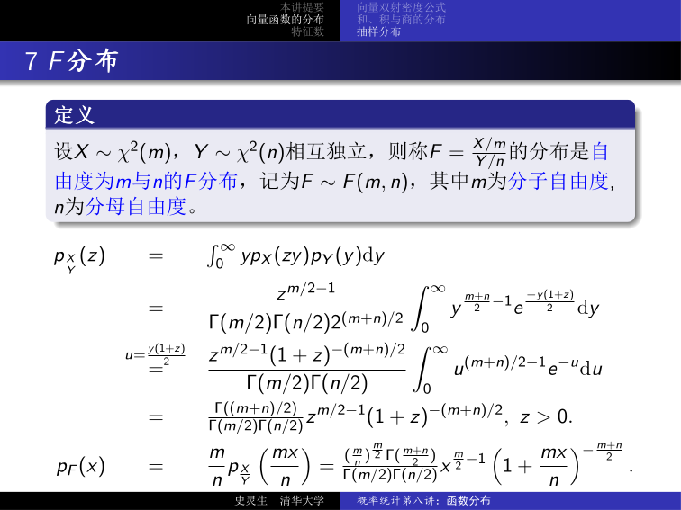

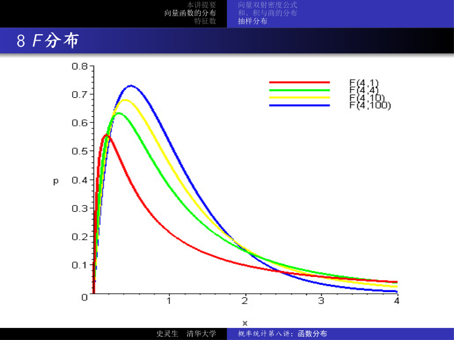

---

## 8 $t$ 分布

!!! abstract "定义（$t$ 分布）"

    设 $X \sim N(0, 1)$，$Y \sim \chi^2(n)$ 相互独立，则称 $t = \dfrac{X}{\sqrt{Y/n}}$ 的分布是自由度为 $n$ 的 **$t$ 分布**，记为 $t \sim t(n)$。

$t$ 分布的密度函数：

- 由 $X$ 与 $-X$ 同分布知 $t$ 与 $-t$ 同分布（关于 0 对称）
- 又 $t^2 = \dfrac{X^2}{Y/n} \sim F(1, n)$

$$
p_t(x) = \frac{\Gamma\!\left(\frac{n+1}{2}\right)}{\sqrt{n\pi}\;\Gamma\!\left(\frac{n}{2}\right)} \left(1 + \frac{x^2}{n}\right)^{-(n+1)/2}.
$$

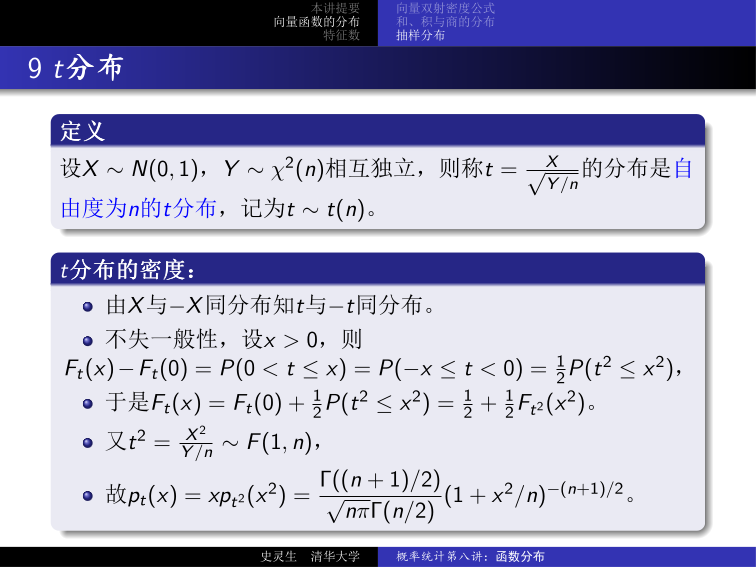

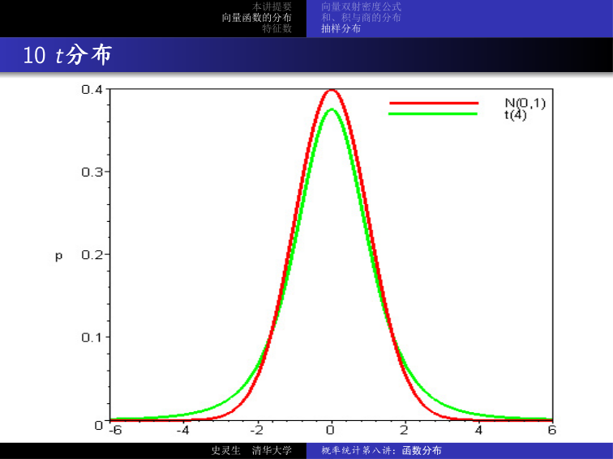

---

## 9 函数的数学期望

!!! abstract "定理（函数的数学期望）"

    若 $g : \mathbb{R}^2 \to \mathbb{R}$ 是二元 Borel 函数且 $g(X, Y)$ 存在数学期望，则：

    $$
    Eg(X, Y) = \begin{cases} \displaystyle\sum_{i,j} g(x_i, y_j)\,p_{ij}, & \text{离散型}, \\[8pt] \displaystyle\iint_{\mathbb{R}^2} g(x, y)\,p(x, y)\,\mathrm{d}x\mathrm{d}y, & \text{连续型}。 \end{cases}
    $$

- 若 $g(x, y) = x$，则 $EX = \sum x_i p_{ij}$（离散）或 $\iint xp(x,y)\,\mathrm{d}x\mathrm{d}y$（连续）
- 特别地，若 $g(x, y) = ax + by$，则 $E(aX + bY) = aEX + bEY$（**期望的线性性**）
- 一般地，$E\!\left(\sum_{i=1}^n c_i X_i\right) = \sum_{i=1}^n c_i EX_i$

???+ example "例 1：二项分布的数学期望"

    求 $X \sim b(n, p)$ 的数学期望。

    将 $X$ 表示成线性和 $X = X_1 + \cdots + X_n$，其中 $X_1, \ldots, X_n \overset{i.i.d.}{\sim} b(1, p)$，

    则 $EX = EX_1 + \cdots + EX_n = np$。

???+ example "例 2：匹配数的期望"

    将 $n$ 个学生的学生证随机地分发给每个人，问平均有多少人恰好拿到自己的学生证？

    记 $X_k$ 为事件“第 $k$ 个人恰好拿到自己的学生证”的示性函数，$X_k \sim b(1, 1/n)$，

    $X = X_1 + \cdots + X_n$，$EX = n \cdot \dfrac{1}{n} = 1$。

---

## 10 独立变量的特征数

!!! abstract "性质（独立变量的特征数）"

    若 $X$ 与 $Y$ 相互独立，则：

    1. $E(XY) = EX \cdot EY$
    2. $\mathrm{Var}(X \pm Y) = \mathrm{Var}(X) + \mathrm{Var}(Y)$

??? note "证明（性质 1）"

    只看离散型，连续型类似。

    $$
    E(XY) = \sum_{i,j} x_i y_j P(X = x_i, Y = y_j) = \sum_{i,j} x_i y_j P(X = x_i)P(Y = y_j) = \left(\sum_i x_i P(X = x_i)\right)\left(\sum_j y_j P(Y = y_j)\right) = EX \cdot EY.
    $$

    $\square$

??? note "证明（性质 2）"

    $$
    \begin{aligned}
    \mathrm{Var}(X \pm Y) &= E[X \pm Y - E(X \pm Y)]^2 \\
    &= E[(X - EX) \pm (Y - EY)]^2 \\
    &= E(X - EX)^2 \pm 2E[(X - EX)(Y - EY)] + E(Y - EY)^2 \\
    &= \mathrm{Var}(X) \pm 2E(X - EX)E(Y - EY) + \mathrm{Var}(Y) \\
    &= \mathrm{Var}(X) + \mathrm{Var}(Y).
    \end{aligned}
    $$

    $\square$

!!! abstract "推论"

    若 $X_1, X_2, \ldots, X_n$ 相互独立，则：

    1. $E(X_1 X_2 \cdots X_n) = EX_1 \cdot EX_2 \cdots EX_n$
    2. $\mathrm{Var}\!\left(\sum_{i=1}^n a_i X_i\right) = \sum_{i=1}^n a_i^2\,\mathrm{Var}(X_i)$

???+ example "例：二项分布的方差"

    $X \sim b(n, p)$，$X = X_1 + \cdots + X_n$，$X_i \overset{i.i.d.}{\sim} b(1, p)$，

    $\mathrm{Var}(X) = \sum_{i=1}^n \mathrm{Var}(X_i) = n\,\mathrm{Var}(X_1) = np(1-p)$。

---

## 11 协方差与相关系数

!!! abstract "定义（协方差与相关系数）"

    对两个随机变量 $X, Y$：

    - **协方差**（covariance）：$\mathrm{Cov}(X, Y) = E[(X - EX)(Y - EY)]$
    - **（线性）相关系数**：$r(X, Y) = \dfrac{\mathrm{Cov}(X, Y)}{\sqrt{\mathrm{Var}(X)\,\mathrm{Var}(Y)}} = \dfrac{\mathrm{Cov}(X, Y)}{\sigma(X)\,\sigma(Y)}$

协方差的计算公式：

$$
\mathrm{Cov}(X, Y) = E[(X - EX)(Y - EY)] = E(XY) - EX \cdot EY.
$$

一般情况下（不要求独立）：

$$
\mathrm{Var}(X + Y) = \mathrm{Var}(X) + 2E[(X - EX)(Y - EY)] + \mathrm{Var}(Y) = \mathrm{Var}(X) + 2\,\mathrm{Cov}(X, Y) + \mathrm{Var}(Y).
$$

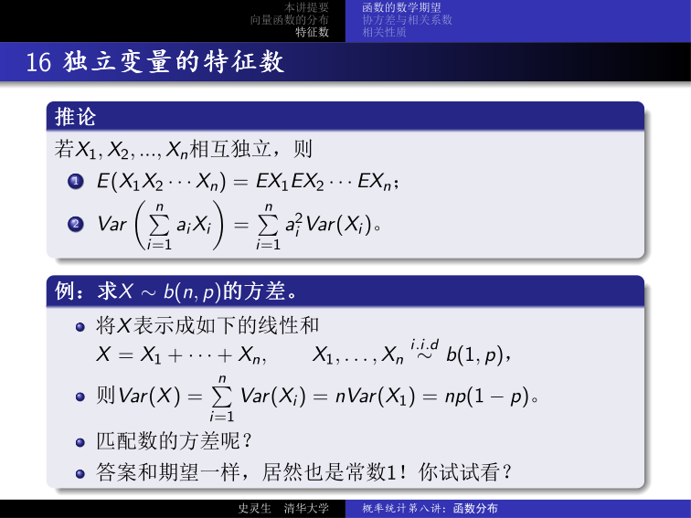

---

## 12 Cauchy-Schwarz 不等式

!!! abstract "引理（Cauchy-Schwarz 不等式）"

    若 $EX^2, EY^2 < \infty$，则：

    $$
    [E(XY)]^2 \leq EX^2 \cdot EY^2,
    $$

    等号成立 $\Leftrightarrow$ $P(X = 0) = 1$ 或 $\exists\, a \in \mathbb{R}$，使得 $P(Y = aX) = 1$。

- $E(XY)$ 的存在性：$|XY| \leq X^2 + Y^2$
- $E(XY)$ 可视为对角线上非负的对称双线性函数
- 定义 **内积** $\langle X, Y \rangle := E(XY)$（注：$EX^2 = 0 \Leftrightarrow P(X = 0) = 1$）
- 内积空间的 Cauchy-Schwarz 不等式：$|\langle X, Y \rangle| \leq \|X\| \cdot \|Y\|$

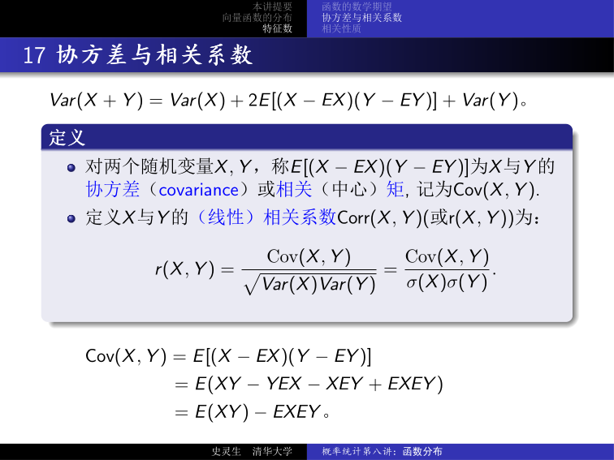

---

## 13 最佳线性预报

回忆：$E(X - m)^2 = \min_a E(X - a)^2$，$m = EX$。

考虑：$E[X - (\hat{a}Y + \hat{b})]^2 = \min_{a,b} E[X - (aY + b)]^2$，$(\hat{a}, \hat{b}) = ?$

在随机变量构成的内积空间中：

$$
\begin{cases} E[X - (aY + b)] = 0, \\ E\{Y[X - (aY + b)]\} = 0. \end{cases}
$$

!!! abstract "定理（最佳线性预报 / 线性回归）"

    解得 $\hat{a} = \dfrac{\mathrm{Cov}(X, Y)}{\mathrm{Var}(Y)}$，$\hat{b} = EX - \hat{a}\,EY$，最佳逼近为：

    $$
    \hat{X} = \frac{\mathrm{Cov}(X, Y)}{\mathrm{Var}(Y)}(Y - EY) + EX.
    $$

    称这个一次函数为 **线性回归**（linear regression）或 **回归直线**（regression line）。

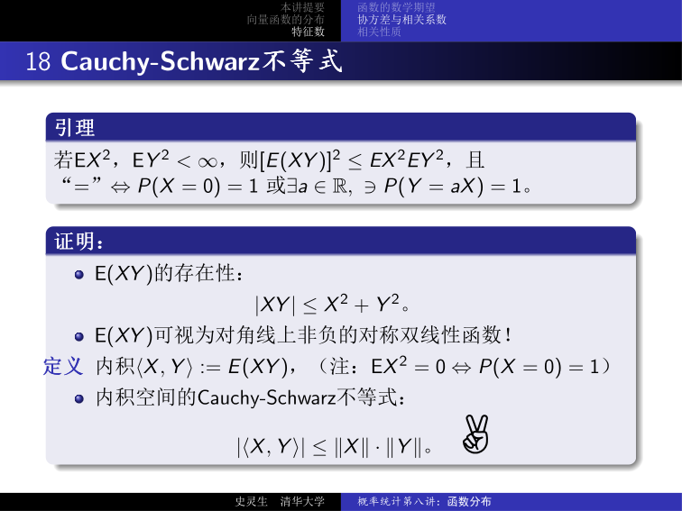

最小误差为：

$$
E(X - \hat{X})^2 = E\!\left[X - EX - \frac{\mathrm{Cov}(X,Y)}{\mathrm{Var}(Y)}(Y - EY)\right]^2 = \mathrm{Var}(X)[1 - r(X,Y)^2].
$$

- 若 $r(X, Y) > 0$（$< 0$，$= 0$），则称 $X$ 与 $Y$ **正相关**（positively correlated）/ **负相关**（negatively correlated）/ **不相关**（uncorrelated）
- 相关系数 $r(X, Y)$ 反映了 $Y$ 数值的变化对 $X$ 的值的影响
- 当 $r(X, Y) = \pm 1$ 时，最小误差为零，此时 $\dfrac{X - EX}{\sqrt{\mathrm{Var}(X)}} = r(X,Y)\dfrac{Y - EY}{\sqrt{\mathrm{Var}(Y)}}$ 以概率 1 成立，这是统计学中线性回归分析理论基础

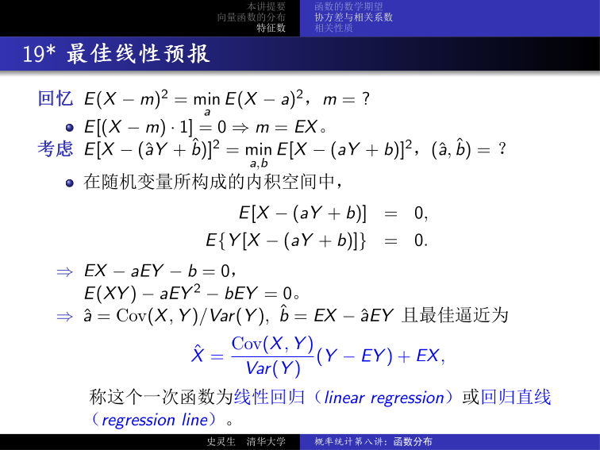

---

## 14 协方差与相关系数的几何解释

!!! tip "内积空间视角"

    在随机变量所构成的内积空间中：

    - 协方差 $\mathrm{Cov}(X, Y)$ 定义了向量 $X - EX$ 和 $Y - EY$ 的 **内积**
    - 方差 $\mathrm{Var}(X)$ 是 $X - EX$ 的 **长度的平方**
    - 标准差 $\sigma(X)$ 是 $X - EX$ 的 **长度**
    - 相关系数 $r(X, Y)$ 确定了向量 $X - EX$ 和 $Y - EY$ 的 **夹角余弦**
    - 期望 $EX$ 是 $X$ 在实数子空间上的 **投影**

!!! abstract "定义（标准化）"

    随机变量 $X$ 的 **标准化**：

    $$
    X^* = \frac{X - EX}{\sqrt{\mathrm{Var}(X)}} = \frac{X - EX}{\sigma(X)},
    $$

    满足 $EX^* = 0$，$\mathrm{Var}(X^*) = 1$。

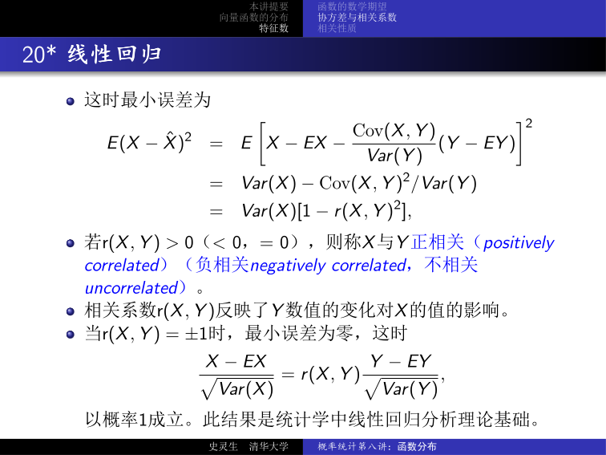

---

## 15 （协）方差（阵）和相关系数的性质

!!! abstract "性质"

    1. $\mathrm{Cov}(X, X) = \mathrm{Var}(X)$；$|\mathrm{Cov}(X, Y)| \leq \sigma(X)\sigma(Y)$，$|r(X, Y)| \leq 1$
    2. 若 $EX^2, EY^2 < \infty$，则 $\mathrm{Cov}(X, Y) = E(XY) - EX \cdot EY$，$\mathrm{Var}(X) = EX^2 - (EX)^2$
    3. 若随机变量 $X$ 与 $Y$ 相互独立，则 $\mathrm{Cov}(X, Y) = 0$；若还知 $\mathrm{Var}(X), \mathrm{Var}(Y) > 0$，则 $r(X, Y) = 0$
    4. $\mathrm{Cov}(\cdot, \cdot)$ 是对称双线性函数，即 $\mathrm{Cov}(X, Y) = \mathrm{Cov}(Y, X)$，$\mathrm{Cov}(aX \pm bY, Z) = a\,\mathrm{Cov}(X, Z) \pm b\,\mathrm{Cov}(Y, Z)$
    5. $\mathrm{Var}\!\left(\sum_{i=1}^n X_i\right) = \sum_{i,j=1}^n \mathrm{Cov}(X_i, X_j) = \sum_{i=1}^n \mathrm{Var}(X_i) + 2\!\!\sum_{1 \leq i < j \leq n}\!\! \mathrm{Cov}(X_i, X_j)$
    6. 当 $X_1, \ldots, X_n$ 两两不相关时，$\mathrm{Var}\!\left(\sum_{i=1}^n X_i\right) = \sum_{i=1}^n \mathrm{Var}(X_i)$
    7. 随机变量 $\mathbf{X} = (X_1, \ldots, X_n)$ 的 **协方差矩阵** $\mathrm{Cov}(\mathbf{X})$ 是对称非负定矩阵，对角线元素分别为 $X_1, \ldots, X_n$ 的方差。当 $X_1, \ldots, X_n$ 独立时，协方差矩阵是对角矩阵

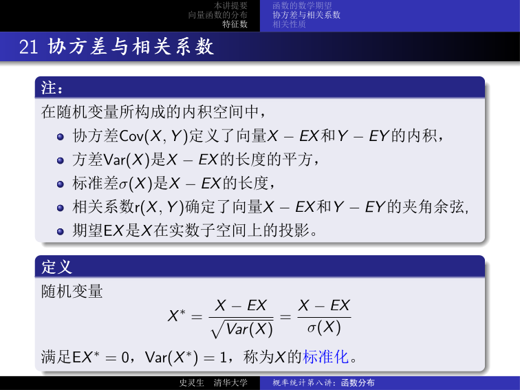

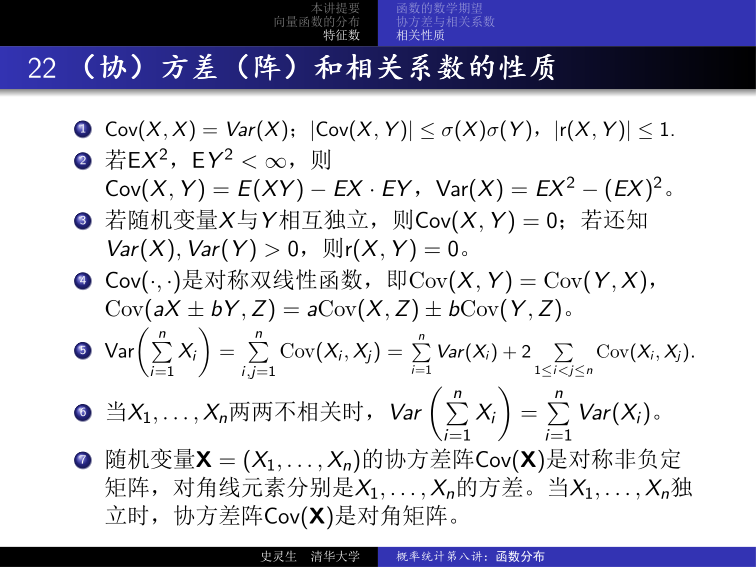

---

## 16 独立和相关

!!! abstract "性质"

    $\mathrm{Cov}\!\left(\sum_{i=1}^n a_i X_i,\; \sum_{j=1}^n b_j X_j\right) = (a_1, \ldots, a_n)\,\mathrm{Cov}(\mathbf{X})\,(b_1, \ldots, b_n)^T$。

!!! warning "独立 $\Rightarrow$ 不相关；但不相关 $\not\Rightarrow$ 独立"

    **反例：** 设 $\Theta$ 均匀分布于 $\{0, \pi/2, \pi, 3\pi/2\}$，令 $X = \cos\Theta$，$Y = \sin\Theta$，则：

    - $EX = EY = 0$
    - $\mathrm{Cov}(X, Y) = E(XY) = \frac{1}{2}E(\sin 2\Theta) = 0$，即 $r(X, Y) = 0$（不相关）
    - 但 $X^2 + Y^2 = 1$，不独立！

    因为 $P(X = 0) = P(Y = 0) = 1/2$，$P(X = Y = 0) = 0 \neq P(X=0)P(Y=0)$。

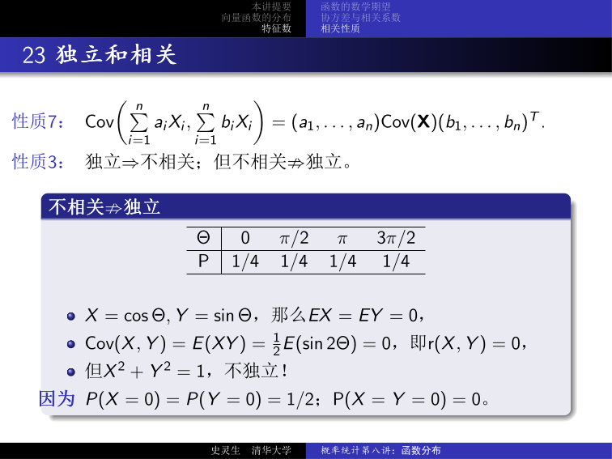

---

## 17 超几何分布 $h(n, N, M)$

???+ example "例：超几何分布的期望与方差"

    设有 $N$ 件产品，其中有 $M$ 件次品。若从中不放回地随机抽取 $n$ 件检验，记 $X_i$ 为事件“第 $i$ 次结果是次品”的示性函数，则抽检次品总数 $X = \sum_{i=1}^n X_i$ 且 $X \sim h(n, N, M)$。

    - $P(X_i = 1) = M/N$，$\forall\,i$，$X_i \sim b(1, M/N)$
    - $EX_i = M/N$，$EX = \sum_i EX_i = nM/N$
    - $\mathrm{Var}(X_i) = \dfrac{M}{N}\!\left(1 - \dfrac{M}{N}\right) = \dfrac{M(N-M)}{N^2}$
    - $P(X_i = X_j = 1) = P(X_1 = X_2 = 1) = \dfrac{M(M-1)}{N(N-1)}$
    - $\mathrm{Cov}(X_i, X_j) = E(X_i X_j) - EX_i \cdot EX_j = \dfrac{M(M-1)}{N(N-1)} - \dfrac{M^2}{N^2} = -\dfrac{M(N-M)}{N^2(N-1)}$
    - $\mathrm{Var}(X) = n\dfrac{M(N-M)}{N^2} - 2\dbinom{n}{2}\dfrac{M(N-M)}{N^2(N-1)} = n\dfrac{M(N-M)}{N^2} \cdot \dfrac{N-n}{N-1}$

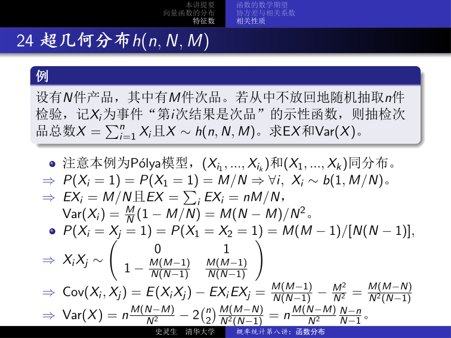

---

## 18 标准正态分布的协方差

$(X, Y) \sim N(0, 0, 1, 1, \rho)$ 时：

$$
p(x, y) = \frac{1}{2\pi\sqrt{1 - \rho^2}} e^{-\frac{x^2 - 2\rho xy + y^2}{2(1-\rho^2)}} = \frac{1}{\sqrt{2\pi}} e^{-y^2/2}\,g(x, y),
$$

其中 $g(x, y) = \dfrac{1}{\sqrt{2\pi(1-\rho^2)}} e^{-\frac{(x - \rho y)^2}{2(1-\rho^2)}}$（即 $\sim N(\rho y,\; 1 - \rho^2)$）。

$$
\mathrm{Cov}(X, Y) = E(XY) - EX \cdot EY = \iint_{\mathbb{R}^2} xy\,p(x,y)\,\mathrm{d}x\mathrm{d}y = \rho EY^2 = \rho\,\mathrm{Var}(Y) = \rho.
$$

因此 $r(X, Y) = \rho$。

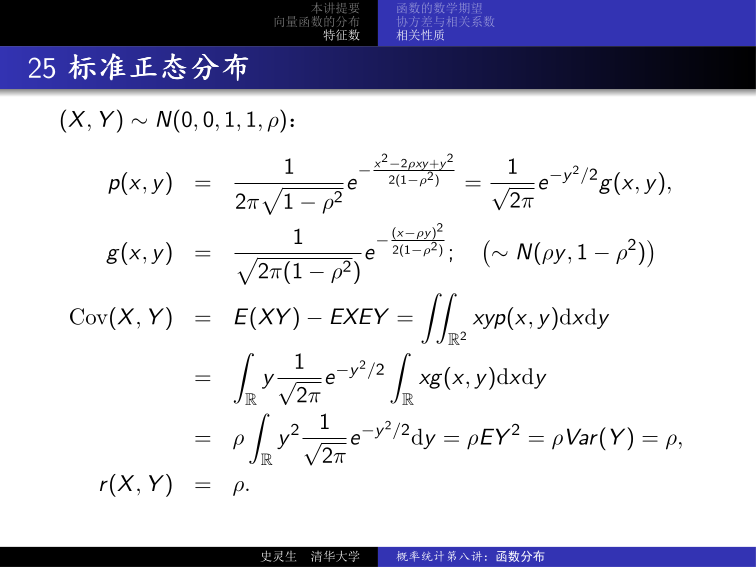

---

## 19 正态分布中不相关与独立等价

!!! abstract "性质"

    若 $(X, Y) \sim N(0, 0, 1, 1, \rho)$，则 $X, Y$ **不相关与独立等价**。

??? note "证明"

    若 $\rho = 0$，则：

    $$
    p(x, y) = \frac{e^{-\frac{x^2 + y^2}{2}}}{2\pi} = \frac{1}{\sqrt{2\pi}} e^{-x^2/2} \cdot \frac{1}{\sqrt{2\pi}} e^{-y^2/2} = p_X(x)\,p_Y(y).
    $$

    $\square$

!!! abstract "推论"

    若 $(X, Y) \sim N(\mu_1, \mu_2, \sigma_1^2, \sigma_2^2, \rho)$，则 $X$ 与 $Y$ **不相关与独立等价**。

证明思路：

- 作标准化：令 $X^* = (X - \mu_1)/\sigma_1$，$Y^* = (Y - \mu_2)/\sigma_2$，则 $(X^*, Y^*) \sim N(0, 0, 1, 1, \rho)$
- $r(X^*, Y^*) = \mathrm{Cov}(X^*, Y^*) = \rho$
- $r(X, Y) = \mathrm{Cov}(\sigma_1 X^* + \mu_1,\; \sigma_2 Y^* + \mu_2) / (\sigma_1 \sigma_2) = \rho$
- $X, Y$ 不相关 $\Leftrightarrow$ $\rho = 0$ $\Leftrightarrow$ $X^*, Y^*$ 相互独立 $\Leftrightarrow$ $X, Y$ 相互独立

---

## 20 总结

| 主题 | 核心公式 |
|------|--------|
| 双射密度公式 | $p_{U,V}(u,v) = p(x(u,v), y(u,v))\lvert J(u,v)\rvert$ |
| 和的分布 | $p_U(u) = \int p(u-v, v)\,\mathrm{d}v$ |
| 积的分布 | $p_U(u) = \int p(u/v, v)/\lvert v\rvert\,\mathrm{d}v$ |
| 商的分布 | $p_U(u) = \int p(uv, v)\lvert v\rvert\,\mathrm{d}v$ |
| $F$ 分布 | $F = \frac{X/m}{Y/n}$，$X \sim \chi^2(m)$，$Y \sim \chi^2(n)$ 独立 |
| $t$ 分布 | $t = \frac{X}{\sqrt{Y/n}}$，$X \sim N(0,1)$，$Y \sim \chi^2(n)$ 独立 |
| 期望线性性 | $E(aX + bY) = aEX + bEY$ |
| 独立变量 | $E(XY) = EX \cdot EY$，$\mathrm{Var}(X \pm Y) = \mathrm{Var}(X) + \mathrm{Var}(Y)$ |
| 协方差 | $\mathrm{Cov}(X,Y) = E(XY) - EX \cdot EY$ |
| 相关系数 | $r(X,Y) = \mathrm{Cov}(X,Y) / [\sigma(X)\sigma(Y)]$ |
| 线性回归 | $\hat{X} = \frac{\mathrm{Cov}(X,Y)}{\mathrm{Var}(Y)}(Y - EY) + EX$，最小误差 $= \mathrm{Var}(X)[1 - r^2]$ |
| 标准化 | $X^* = (X - EX)/\sigma(X)$，$EX^* = 0$，$\mathrm{Var}(X^*) = 1$ |
| 协方差矩阵 | $\mathrm{Var}(\sum X_i) = \sum \mathrm{Var}(X_i) + 2\sum_{i<j}\mathrm{Cov}(X_i, X_j)$ |
| 独立 vs 不相关 | 独立 $\Rightarrow$ 不相关；不相关 $\not\Rightarrow$ 独立（正态分布中等价） |
| 超几何分布 | $EX = nM/N$，$\mathrm{Var}(X) = n\frac{M(N-M)}{N^2}\frac{N-n}{N-1}$ |
| 标准正态 | $(X,Y) \sim N(0,0,1,1,\rho)$ 时 $r(X,Y) = \rho$ |
