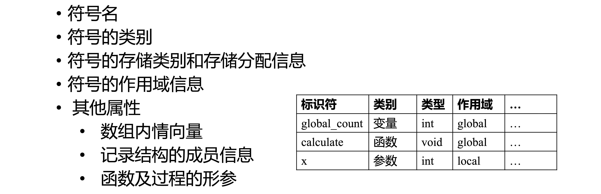
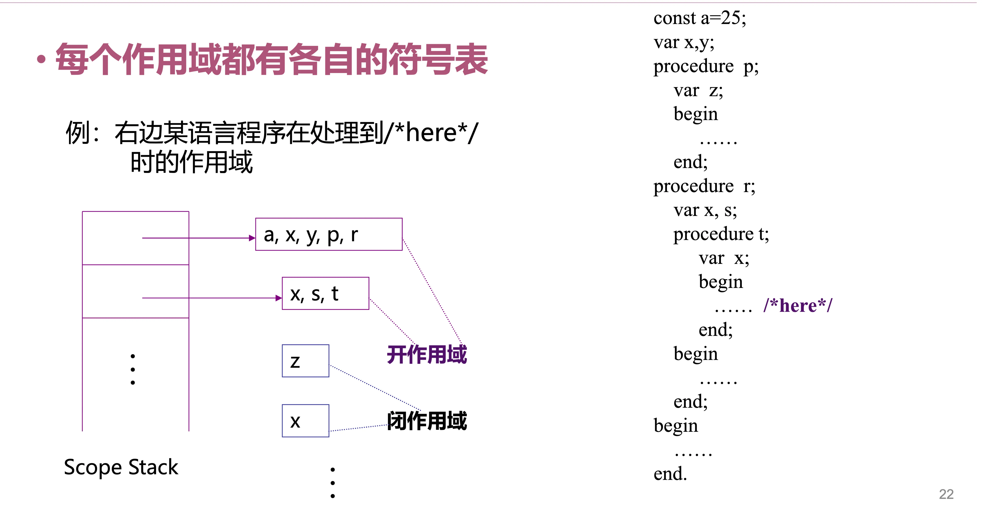

# 符号表的作用

- 存放有关**标识符**的信息
- 用于**静态语义检查**和**产生中间代码**
- 对符号进行地址分配
- 多遍扫描时，符号表可能有所不同
- 可能检查的内容：
  - 是否先声明后使用？是否重复声明？
  - 类型检查
  - 作用域检查

# 符号表的常见属性

# 符号表的实现

# 符号表的作用域与可见性

- 符号表体现作用域信息：
  - 所有作用域共用一个**全局符号表**
  - 或每个作用域有各自的符号表
- **嵌套的作用域**：
  - 某个点所在的作用域为：当前作用域
  - 当前作用域与**包含它的程序单元**构成的作用域：**开作用域**
  - 不属于开作用域的：**闭作用域**
- **可见性规则**：
  - 在程序的任何一点，只有在该点**开作用域**中声明的名字才是可访问的
  - 若在**多个**开域中被声明，则选取**最近的声明**当作解释
- 作用域与单符号表组织（课件示例见 [slide4.pdf 第 19 页附近](../assets/编译原理/slide4.pdf#page=19)）：

- 作用域与多符号表组织（课件示例见 [slide4.pdf 第 22 页附近](../assets/编译原理/slide4.pdf#page=22)）：

---

## 相关笔记

- 语法分析阶段与 [自顶向下语法分析](自顶向下语法分析.md)、[自底向上语法分析](自底向上语法分析.md) 衔接；语义检查阶段会大量使用符号表。
