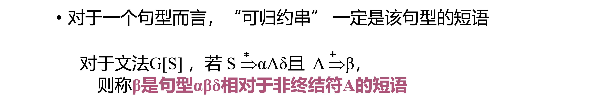
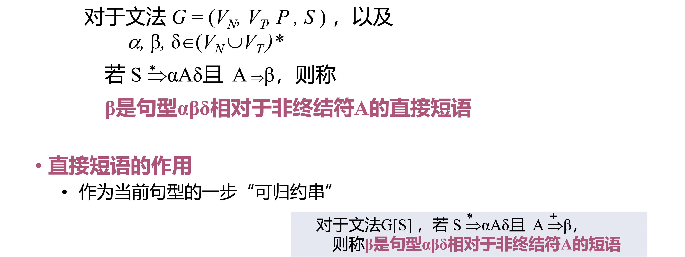
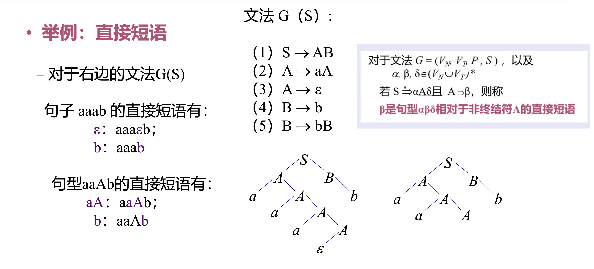
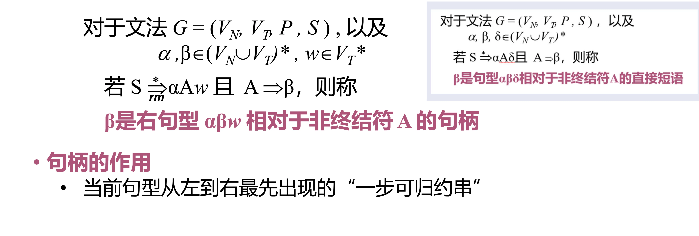
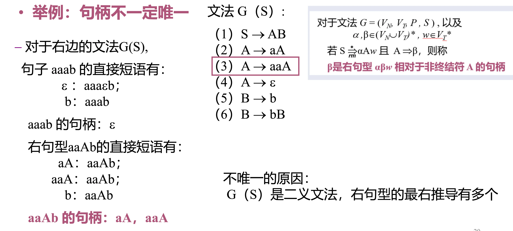
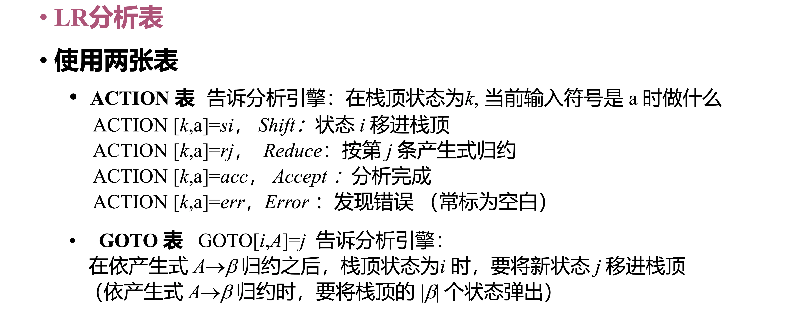
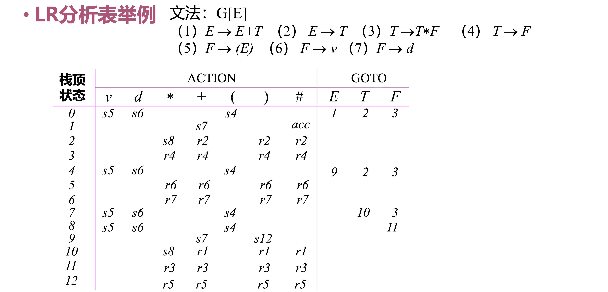

# 基本思想

- 从要分析的**终结符串**开始规约
- 每一步找出和某个**产生式右部**匹配的子串，替换成产生式左部
- 直到规约至开始符号

# 非确定性

- 每一步规约中：选择哪一个产生式、匹配哪一个位置的子串，是非确定的
- 改进方法：选择**可规约串**进行规约
  - **句型**：推导过程中的中间字符串（一定可由开始符号导出）
  - **短语**：句型中，某个**非终结符**可以**生成**的字符串
  - 短语一定是：**当前句型的子串**，且可以由一个非终结符生成

## 直接短语

- 可以理解为：当前句型的某个子串，这个子串可以由一个非终结符**直接**生成

## 句柄

- 可以理解为：使用句柄规约出的句型，一定是**最左规约、最右推导**
- 但句柄也是**不唯一的**，例如遇到了**二义文法**

# 移进—规约分析

- 通过一个**下推栈**，和一个基于**有限状态控制**的分析引擎
- 分析引擎会有如下动作：规约、移进一个输入、发现语法错误、分析成功
- 两类冲突：
  - **移进—规约冲突**：不知道下一步应该移进还是规约
  - **规约—规约冲突**：不知道应该选择哪个产生式规约

# LR 分析

## 含义

- **L**：从左到右扫描输入单词序列
- **R**：产生的是**最右推导**的逆过程（最左规约）
- **LR(0)**：向前查看 0 个符号

## LR 分析表

---

## 相关笔记

- 自顶向下路线见 [自顶向下语法分析](自顶向下语法分析.md)
