# 核心问题

- 经过词法分析处理后，源程序变成：
  - 单词流的形式
  - 需要通过语法分析，判断单词组成的句子是否合法
- 本质上：
  - 相当于 [上下文无关文法](https://zh.wikipedia.org/wiki/上下文无关文法) 的匹配
  - 对于给定的上下文无关文法，某个由合法单词组成的句子，是否符合句法
  - 如果符合，则给出语法分析树或最左推导

# 常见报错

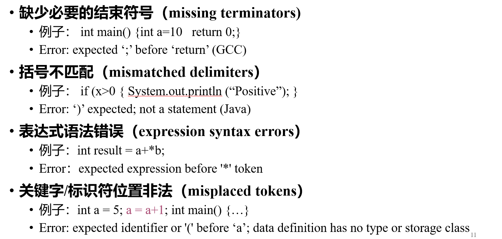

# 自顶向下分析

## 基本概念

- 同上下文无关语言的自顶向下分析过程
- 由开始符号推导到句子

## 带回溯的自顶向下分析

- 采用最左推导：每次替换最左边的非终结符
- 非确定性：每次选择哪一个产生式来进行替换是非确定的
- 带回溯的分析：类似一个深度优先搜索
- 改进：确定的自顶向下分析
  - 主要是要确定每一次推导选择 **哪个产生式**
  - **向前查看**：如果当前读入的单词不能决定非终结符应该选择哪个产生式，则再考虑后面的几个单词（注意：这里是纯粹考虑过程，实际匹配的只有当前的字符）
- 左递归：
  - 形式：A → A x x x x
  - 推导出以自己开头的表达式
  - 不利于预测分析

## 自顶向下预测分析

- 要求文法不含左递归：
  - 直接左递归：A → A x x x
  - 间接左递归：A → B x x x，B → A x x x
  - 需要通过文法变换消除左递归
- 要求文法不含左公因子
- **LL(k)**：LL 表示自顶向下、最左推导；k 表示最多向前查看 k 个单词就可以决定产生式

## LL(1) 分析

- 重要的两个集合：**First 集合** 和 **Follow 集合**
- 作用：基于下一个输入的符号，判断采用哪个产生式

### First 集合

- 首先考虑对于任意一个**句子**的 First 集合：
- 如果一个句型可以推导出另一个以某**终结符**开头的句型，则该终结符属于 First
- 如果 A → α | β，且 First(α) 与 First(β) 没有交集，则向后看一个单词，就知道选哪个产生式

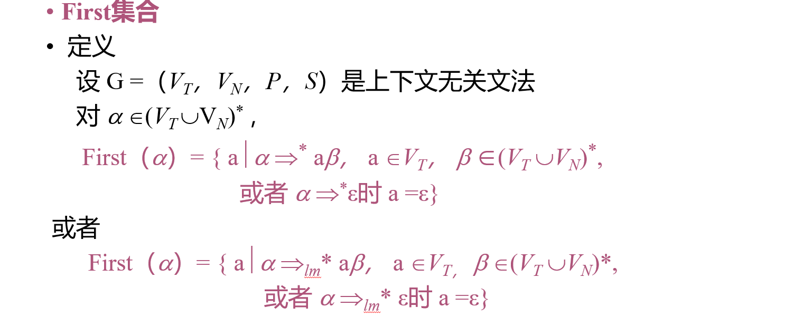

- 对于一个文法的 First 集合的计算：
  - 需要计算的元素为：所有终结符、非终结符、ε、产生式右部的后缀
  - 如果有个非终结符可以推导到 ε，将 ε 加入其 First
  - 对于一个多个符号构成的串：
    - 考察其所有前缀，找到第一个不属于 First(Yᵢ) 的 ε 的 Yᵢ
    - 则前面的都可以导出 ε，因此首元素可以是所有 First(Yⱼ) 中的任意元素
    - 如果不存在这样的 Yᵢ，则即是所有非终结符 First 集合的并集
  - 对于产生式，左部并上右部的 First

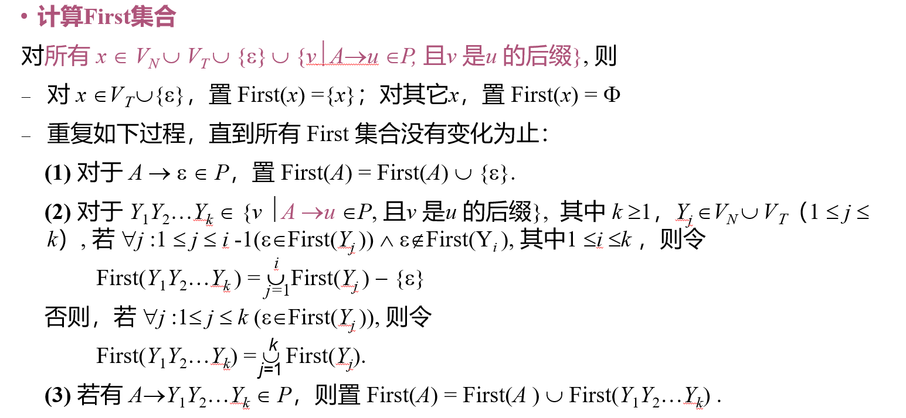

### Follow 集合

- 为什么要用 Follow 集合？
  - First(A) 可能包含 ε：仅看 First 不足以区分「用哪条产生式」与「A 是否应推导为空」——当当前输入符号不在各候选首符集合里时，仍可能靠 A ⇒* ε 再依赖 **Follow(A)** 做决策
- Follow 集合的含义：
  - Follow(A) 代表紧跟着 A、可能出现的**终结符**集合
  - 可以理解为：如果此时 A 推导完了，则其后可能跟的字符有哪些
  - 参见 [Follow 集合的简明理解](Follow-集合的简明理解.md)
- 使用 Follow 集合：
  - 首先是看 First(A)，如果 a 属于 First(A)，则选用产生式
  - 如果不属于，则看 Follow(A)，如果属于 Follow(A)，则跳过 A（选 ε）
  - 否则分析出错

- 计算 Follow 集合：

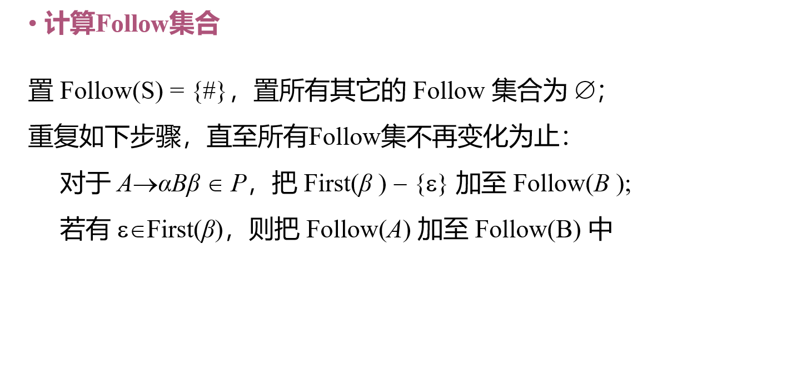

- 理解：
  - 第一条规则：如果 B 推导完了，后面可能跟着的终结符就是 First(β)
  - 第二条规则：如果 B 后面可以啥都不跟，那么 B 和 A 可以推导为同一个结尾，则 A 推导完成后可能接着的终结符，也可以当作 B 推导完成后可能接着的终结符

### 预测集合

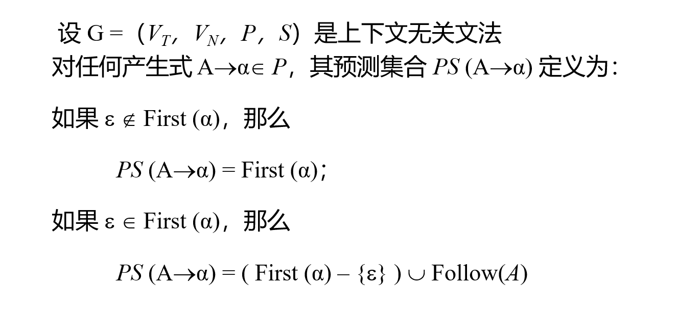

- 这就是在读到一个字符时，判断选用哪个产生式的依据
- LL(1) 文法中，任意两个产生式的预测集合没有交集，因此可以据此选用
- 这也是判断 LL(1) 文法的依据：

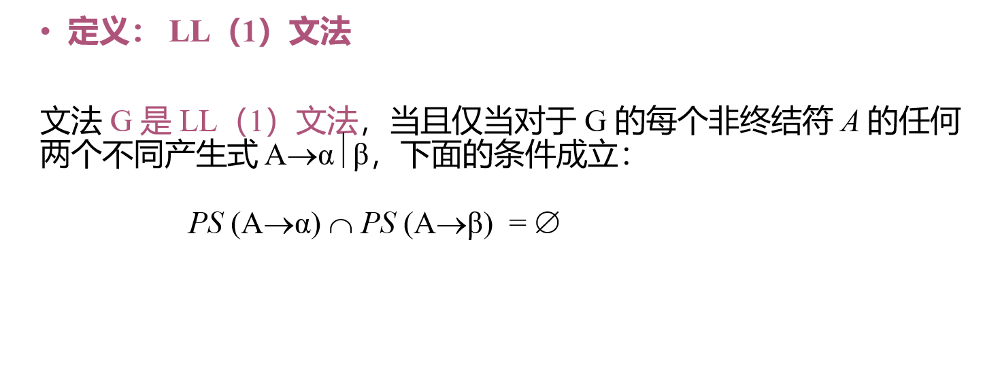

## LL(1) 分析

### 基本思想

- 每一个非终结符对应一个分析子程序
  - 子程序的处理：根据预测集合来选择产生式，或者是否抛弃
- 递归下降
  - 栈顶每读到一个终结符，则匹配同时弹栈
  - 栈顶是非终结符，调用子程序
- 借助预测分析表和**下推栈**

- 分析过程：

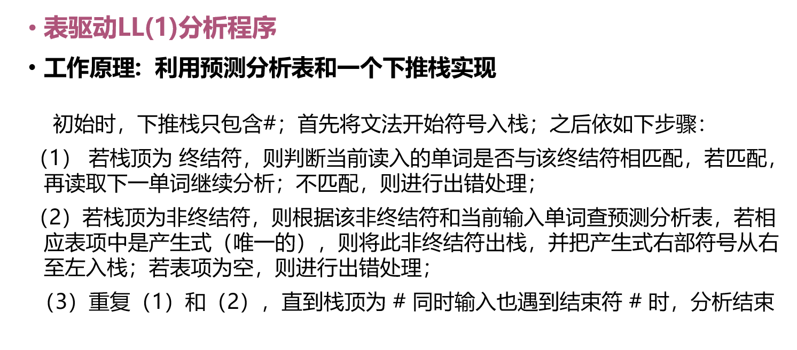

- 预测分析表：

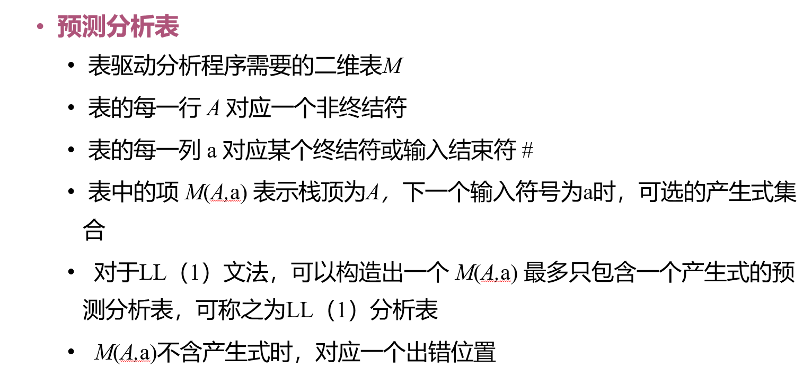

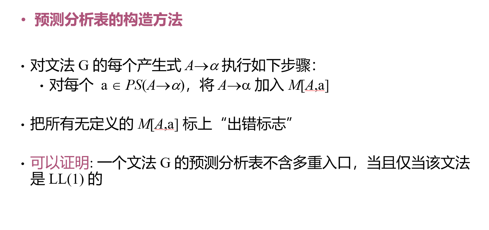

# 消除左递归

- 某些文法可以消除左递归，从而实现文法的化简
- 消除直接左递归
  - 把产生式分为两部分：用了左递归的和没用的
  - 由于左递归最终肯定**用且仅用了一次非递归的产生式**，因此可以把非递归的提前

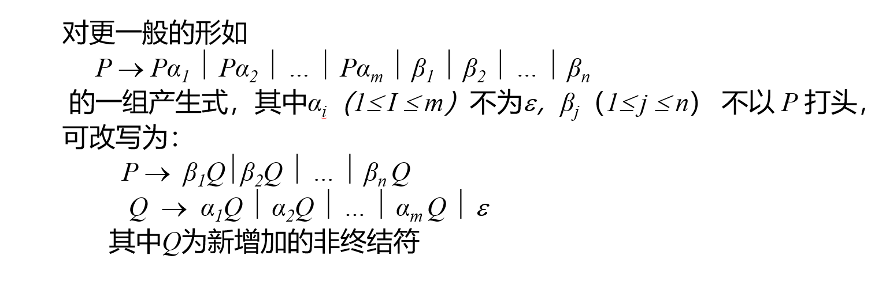

- 消除间接左递归

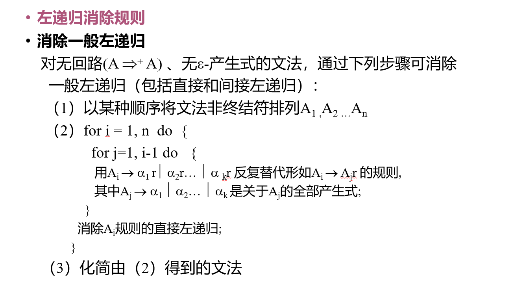

- 举例：

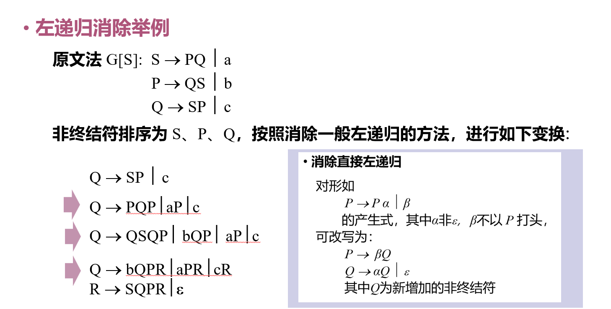

# 提取左公因子

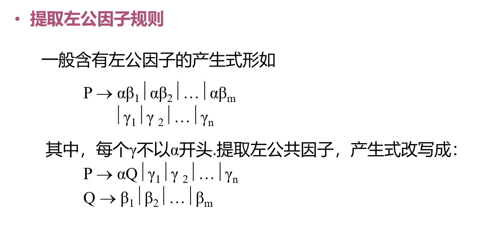

# LL(1) 文法的生成

- 许多文法在**消除左递归**和提取**左公因子**后，可以变成 LL(1) 文法
- 但不一定都可以变成 LL(1) 文法

# LL(1) 文法的错误处理

- 可能情况：
  - 栈顶的终结符和当前输入符号不匹配
  - 分析表的当前表项为空
- 处理方法：
  - 简单的应急恢复：跳过输入串中的一些符号，直到遇到同步符号（可以将 Follow(A) 中符号作为同步符号）
- 短语层恢复：

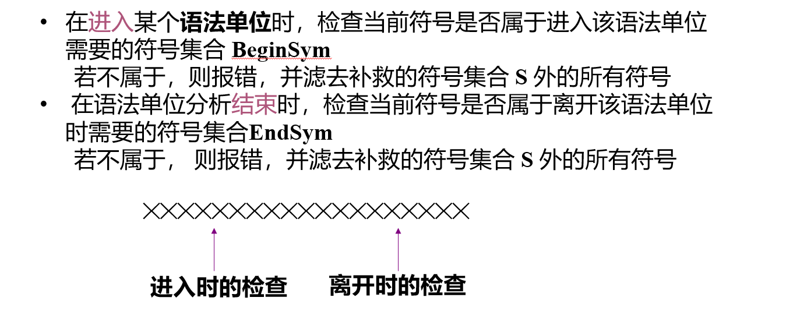

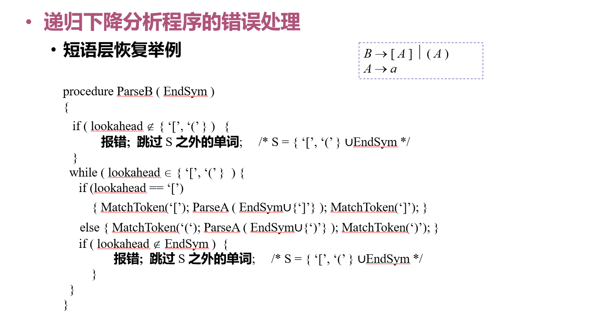

# LL(k) 文法的结论

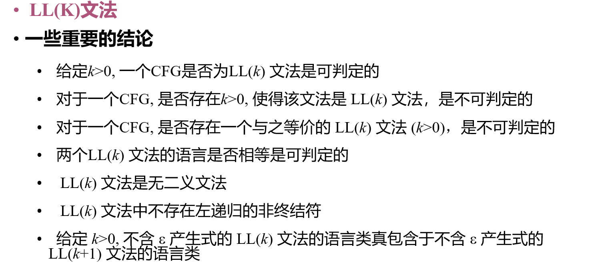

---

## 相关笔记

- [Follow 集合的简明理解](Follow-集合的简明理解.md)（Follow 与 ε 决策）
- 另一类思路见 [自底向上语法分析](自底向上语法分析.md)
